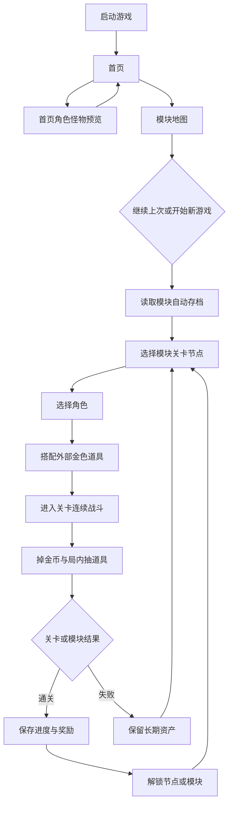
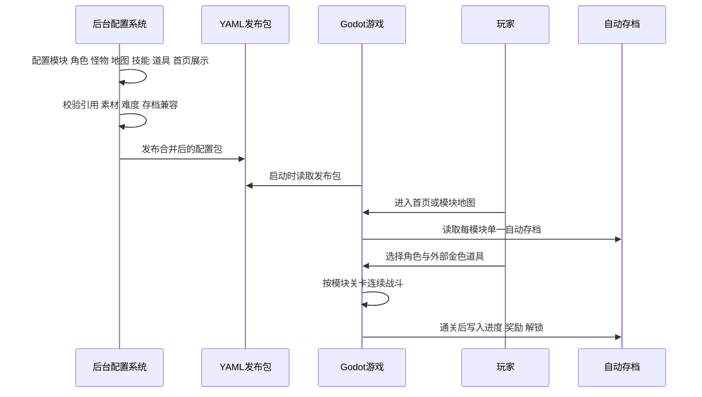

# 需求点总览 v1

## 文档信息

| 项目 | 内容 |
| --- | --- |
| 创建时间 | 2026-06-23 21:54:45 |
| 文档状态 | 草案评审版 |
| 整理目标 | 将当前项目已确认的玩法、配置、后台、素材、存档、发布和工具链需求重新收束成统一入口。 |
| 适用范围 | Steam/PC 端 2D 自动战斗闯关游戏、Godot 4 主游戏工程、`admin/` 后台配置系统、`game/data/` YAML 配置体系。 |
| 当前真源 | 根目录 [项目设计.md](../../项目设计.md) 为顶层约束，本文用于需求点索引和后续拆分。 |

## 资料来源

| 来源 | 用途 |
| --- | --- |
| [项目设计.md](../../项目设计.md) | 当前最高级产品方向与工程约束。 |
| [模块化关卡最高级原则](2026-06-08_234500_模块化关卡最高级原则.md) | 早期主需求与历史变更记录。 |
| [附录-全配置驱动完善方案](../1-架构/附录-全配置驱动完善方案.md) | 零硬编码、配置发布、回滚、校验、兼容和调试规则。 |
| [附录-后台系统结构方案](../1-架构/附录-后台系统结构方案.md) | Go + Vue 后台系统信息架构与编辑发布流程。 |
| [附录-后台字段级配置规范](../1-架构/附录-后台字段级配置规范.md) | 后台实体字段、首页展示字段和可覆盖字段。 |
| [附录-配置目录规范](../1-架构/附录-配置目录规范.md) | `game/data/` 三层目录和实体目录化规则。 |
| [附录-游戏侧配置读取与合并规范](../1-架构/附录-游戏侧配置读取与合并规范.md) | 游戏侧发布包读取、合并、缓存、兼容和错误处理。 |
| [附录-中文命名与UTF8规范](../1-架构/附录-中文命名与UTF8规范.md) | 中文展示名、稳定 ID 和 UTF-8 边界。 |

## 总体定位

本项目是一款面向 Steam/PC 平台的 2D 自动战斗闯关游戏。关卡组织参考《植物大战僵尸》的模块章节与节点推进，战斗体验参考《土豆兄弟》的地图内移动、自动攻击、持续清怪和局内成长节奏。

当前产品方向不是无尽模式主循环，而是模块化关卡选择制：玩家从模块地图进入不同主题模块，模块内按关卡节点连续推进，不同模块拥有不同地图、怪物生态、机制和视觉包装。

## 需求主流程

## 系统协作时序

## P0 核心需求

| 编号 | 领域 | 需求点 | 当前规则 |
| --- | --- | --- | --- |
| REQ-P0-001 | 产品形态 | Steam/PC 正式游戏 | 第一阶段也按 PC 桌面游戏交付，具备窗口、分辨率、键鼠输入、HUD、音画反馈和可导出构建。 |
| REQ-P0-002 | 主引擎 | Godot 4 | 主游戏工程使用 Godot 4，不用 CSS/Web 作为主战斗、渲染、碰撞和动画实现。 |
| REQ-P0-003 | 主循环 | 模块化关卡选择 | 游戏默认进入模块地图或模块选择流程，不把无尽模式作为主循环。 |
| REQ-P0-004 | 关卡结构 | PvZ 式模块节点 | 模块包含地图分区、关卡节点、逐关解锁、模块 Boss 或模块终点。 |
| REQ-P0-005 | 战斗体验 | Brotato 式地图战斗 | 玩家在地图内移动，角色自动攻击，怪物持续刷新并形成战斗压力。 |
| REQ-P0-006 | 模块规模 | 每模块默认 20 关 | 默认每个游戏模块 20 关，特殊模式另行配置。 |
| REQ-P0-007 | 单关时长 | 默认 60 秒 | 每关默认持续 60 秒，关卡之间连续推进，不在每关结束后暂停等待。 |
| REQ-P0-008 | 背包暂停 | `I` 键打开背包 | 背包打开等同暂停，怪物技能动作和角色技能动作都暂停，玩家可抽取道具和查看提示。 |
| REQ-P0-009 | 加速 | 第一版 1x/2x/3x | 当前主设计以 1x、2x、3x 三档循环为第一版要求，历史 10x 目标不作为第一版验收要求。 |
| REQ-P0-010 | 难度来源 | 不靠堆血量 | 难度主要来自技能解锁、怪物组合、Boss 形态、地图压力和模块机制。 |
| REQ-P0-011 | 难度档位 | 普通、噩梦、地狱 | 每个模块默认三档难度，难度控制怪物技能开放、Boss 出现关卡和狂暴触发。 |
| REQ-P0-012 | 怪物分层 | 普通、精英、BOSS | 普通怪物 3 个基础技能；精英怪物 3 基础 + 1 终极；BOSS 支持基础、终极、狂暴形态。 |
| REQ-P0-013 | 技能冷却 | 默认基础 5 秒、终极 45 秒 | 默认基础技能 CD 为 5 秒，终极技能 CD 为 45 秒，可由配置覆盖。 |
| REQ-P0-014 | Boss 形态 | 基础、终极、狂暴 | 终极形态在基础形态能力上追加 3 基础 + 1 终极；狂暴形态在终极形态死亡后按难度概率触发，满血恢复，攻速、移速、技能 CD 加快一倍，血量上限不增加。 |
| REQ-P0-015 | 普通难度 | 固定随机技能 | 同一种普通怪物、精英怪物和 BOSS 基础形态在本局开始随机固定 1 个基础技能，通关或退出前不变。 |
| REQ-P0-016 | 噩梦难度 | 完整技能与双 Boss 节点 | 普通和精英怪物可用全部技能，第 10 关基础形态 Boss，第 20 关终极形态 Boss。 |
| REQ-P0-017 | 地狱难度 | 更早 Boss 与狂暴 | 第 5 关基础形态 Boss，第 10 关终极形态 Boss，第 20 关终极形态死亡后按概率触发狂暴。 |
| REQ-P0-018 | 角色设计 | 固定武器与固定技能 | 每个角色绑定固定武器和固定技能，不做角色技能升级树，不做角色武器切换。 |
| REQ-P0-019 | 道具分层 | 普通、紫色、金色 | 普通和紫色为模块内临时道具；金色分临时金色和永久金色。 |
| REQ-P0-020 | 永久金色 | 极低概率通关获得 | 永久金色道具不能通过抽奖获得，只能通过通关极低概率获得，游戏结束不消失。 |
| REQ-P0-021 | 临时道具 | 模块结束消失 | 普通、紫色、临时金色都只在当前模块内抽取和使用，模块结束后消失。 |
| REQ-P0-022 | 存档 | 每模块单一自动存档 | 用户没有手动存档和多个存档槽，只提供继续上次与开始新游戏。 |
| REQ-P0-023 | 被动保存 | 镜像当前进度 | 游戏被动保存模块进度、关卡状态、长期资产和必要运行恢复信息。 |
| REQ-P0-024 | 失败保护 | 不惩罚长期资产 | 失败不清除已通关关卡、模块解锁、永久金色道具和长期资产。 |
| REQ-P0-025 | 首页预览 | 角色与怪物说明入口 | 首页提供轻量入口，展示后台选择的角色、怪物、BOSS、技能说明和动画预览。 |
| REQ-P0-026 | 配置驱动 | YAML 真源 | 所有游戏内容优先通过 YAML 配置定义。 |
| REQ-P0-027 | 零硬编码 | 能配置就不写死 | 新增模块、角色、技能、怪物、关卡、地图和掉落规则原则上只改配置，不改代码。 |
| REQ-P0-028 | 后台系统 | `admin/` Go + Vue | 后台负责内容编辑、素材绑定、校验、预览、发布和回滚。 |
| REQ-P0-029 | 目录分层 | `control/global/modules` | `control/` 负责首页和公共入口，`global/` 负责公共实体，`modules/` 负责模块配置和覆盖。 |
| REQ-P0-030 | 配置发布 | 游戏只读发布包 | 游戏侧只读取后台发布后的标准化结果，不读取后台草稿。 |
| REQ-P0-031 | 素材流程 | 先 imagegen 后 Godot | 正式 2D 素材先通过 `imagegen` 设计，再通过 Godot AI MCP 构建和接入。 |
| REQ-P0-032 | 中文与 ID | 中文显示 + 稳定 ID | 中文用于可读展示，稳定 ID 用于系统引用、版本兼容和存档。 |
| REQ-P0-033 | UTF-8 | 中文编码稳定 | 中文文档、配置、文案和注释统一 UTF-8，禁止乱码。 |
| REQ-P0-034 | Windows 交付 | exe + 安装器 + 快捷方式 | 第一阶段维护 Godot Windows 导出和安装器流程。 |

## P1 Demo 前需求

| 编号 | 领域 | 需求点 | 说明 |
| --- | --- | --- | --- |
| REQ-P1-001 | 新手引导 | 首次进入教学 | 需要说明模块地图、连续关卡、背包暂停、局内抽道具、永久金色道具。 |
| REQ-P1-002 | 数值验证 | 压力曲线预览 | 后台应能预估刷怪压力、金币收益、道具抽取期望、Boss 压力和关卡节奏。 |
| REQ-P1-003 | 配置依赖图 | 引用影响分析 | 删除或改名角色、怪物、技能、地图、素材时，后台必须展示影响面。 |
| REQ-P1-004 | 版本矩阵 | 游戏/配置/模块/素材/存档版本 | 发布、回滚、兼容和问题定位必须能追踪版本组合。 |
| REQ-P1-005 | 发布前自动测试 | 配置冒烟验证 | 发布前检查模块完整性、20 关连续性、Boss 关卡、素材缺失、引用断链和难度映射。 |
| REQ-P1-006 | 运行降级 | 配置或素材异常处理 | 配置包损坏、素材丢失、引用失败时，游戏应明确报错并尽量降级，不静默失败。 |
| REQ-P1-007 | Steam/PC 细节 | 平台能力边界 | 成就、云存档、手柄、Steam Deck、窗口化、分辨率和构建版本号需要提前定边界。 |
| REQ-P1-008 | 资产生产流水线 | 素材审查与版本 | 需要管理 imagegen brief、帧动画、切帧、审核、Godot 导入、后台绑定和素材版本。 |

## P2 长期边界

| 编号 | 领域 | 需求点 | 说明 |
| --- | --- | --- | --- |
| REQ-P2-001 | Mod/UGC | 是否开放玩家自定义 | 第一版默认不开放，避免把内部后台配置误解为玩家 Mod 工具。 |
| REQ-P2-002 | 埋点隐私 | 本地还是上传 | 如果做统计，需要定义数据范围、采样率、保留时间、玩家授权和隐私提示。 |
| REQ-P2-003 | 多语言 | 简体中文之外 | 第一版只交付简体中文，但配置和 UI 需预留国际化。 |
| REQ-P2-004 | 法务授权 | 素材、字体、音频 | AI 生成素材、参考素材、第三方音效和字体都要记录来源、许可和用途。 |
| REQ-P2-005 | 完整图鉴 | 收藏与百科系统 | 当前首页预览不是完整图鉴；完整图鉴、收集率、隐藏条目和成就可作为长期系统。 |

## 后台配置需求

| 模块 | 必须能力 |
| --- | --- |
| 总览 | 展示发布版本、草稿数量、校验失败、实体数量、发布记录、回滚记录和错误日志。 |
| 首页配置 | 配置首页预览入口、展示实体、展示顺序、可见状态、解锁规则、预览素材和技能说明。 |
| 模块管理 | 新建、复制、归档模块，配置模块总信息、节点、难度、奖励、地图和素材包。 |
| 全局资源库 | 管理角色、怪物、BOSS、地图、技能、道具、掉落、刷怪、规则、文案、音频和首页展示包。 |
| 素材资源库 | 上传、浏览、预览、绑定素材，记录来源许可，区分占位图和正式图。 |
| 配置编辑器 | 按实体类型拆分编辑器，避免超级表单。 |
| 校验中心 | 检查必填、类型、范围、ID 冲突、引用缺失、素材缺失、循环引用、难度映射、节点断链、存档兼容风险。 |
| 预览中心 | 预览角色动作、怪物动作、技能特效、地图缩略图、关卡节点、首页展示、掉落概率、音频和文案。 |
| 发布回滚 | 校验通过后生成发布包，记录版本号、变更摘要、兼容说明，支持回滚到稳定版本。 |
| 权限审计 | 至少支持编辑、审核、发布、回滚、管理员，并记录谁在何时改了什么。 |

## 配置与数据目录需求

| 层级 | 职责 |
| --- | --- |
| `game/data/control/` | 总层控制，负责主页、首页预览、模块索引、公共入口和共享导航。 |
| `game/data/global/` | 全局总配置，负责跨模块通用角色、怪物、BOSS、地图、技能、道具、掉落、刷怪、规则和默认值。 |
| `game/data/modules/<module_id>/` | 模块配置，负责模块总配置、模块实体覆盖、模块地图、模块关卡和模块发布产物。 |
| 实体目录 | 角色、怪物、BOSS、地图、技能、VFX、SFX、道具、掉落表、刷怪表、难度包、规则包等采用“实体目录 + 主配置 + assets”。 |
| 首页展示目录 | `game/data/control/home_preview/<preview_pack_id>/` 存放首页预览展示包，只引用实体 ID，不复制实体本体。 |

## 游戏侧运行需求

| 编号 | 需求点 | 规则 |
| --- | --- | --- |
| RUN-001 | 发布包读取 | 游戏启动、进模块、进关卡时读取后台发布包。 |
| RUN-002 | 合并优先级 | 当前统一为 `实体覆盖 > 模块覆盖 > 全局默认 > 内置默认值`。 |
| RUN-003 | 列表合并 | 列表默认整表替换，除非显式声明追加或按 ID 合并。 |
| RUN-004 | 缓存 | 启动缓存索引，进模块缓存模块配置，进关卡缓存当前关卡所需实体。 |
| RUN-005 | 默认值 | 新增字段必须提供默认值，避免缺字段崩溃。 |
| RUN-006 | 兼容 | 删除、更名、废弃字段必须有兼容映射或迁移处理。 |
| RUN-007 | 错误处理 | 缺配置、缺素材、引用错误必须明确报错，标出实体 ID 和来源目录。 |
| RUN-008 | 追踪 | 记录发布版本、模块 ID、关卡 ID、实体 ID、覆盖路径和警告项。 |

## 素材需求

| 类别 | 要求 |
| --- | --- |
| 生产顺序 | 先设计 brief，再 imagegen 生成，再审查，再切帧/整理，再 Godot 接入，再后台绑定。 |
| 覆盖范围 | 角色、怪物、BOSS、地图、瓦片、场景道具、UI、图标、特效、投射物、掉落物、Sprite Sheet、逐帧动画。 |
| 风格目标 | 默认非像素风，偏现代、清晰、完整的商业 2D / 2.5D / 卡通手绘质感。 |
| 地图资产 | 可玩地图不只交付单张背景图，应拆到底图、props、碰撞、区域和可编辑层。 |
| 许可 | 免费素材只作为参考板和结构参考；正式 2D 素材优先原创化，第三方素材必须记录来源和许可。 |
| 入库状态 | 后台需要区分占位素材和正式素材。 |

## 不做范围

| 编号 | 不做项 | 说明 |
| --- | --- | --- |
| OUT-001 | 无尽模式主循环 | 当前主线不以无尽闯关为默认入口。 |
| OUT-002 | 单线性假模块 | 不做只有一串关卡编号的伪模块。 |
| OUT-003 | 堆血量控难度 | 不通过单纯加血、加防御制造难度。 |
| OUT-004 | 角色技能树 | 第一版不做角色技能升级树和武器切换。 |
| OUT-005 | 永久金色抽奖 | 永久金色不能通过抽奖获得。 |
| OUT-006 | 完整图鉴 | 首页预览不是完整图鉴，不做收集率、隐藏条目和成就联动。 |
| OUT-007 | Web 主游戏 | 不使用 CSS 或普通 Web UI 实现主战斗。 |
| OUT-008 | 多存档槽 | 每模块只保留一个自动存档状态。 |
| OUT-009 | 第一版多语言 | 第一版只交付简体中文内容。 |

## 拆分建议

| 波次 | 子系统 | 目标 |
| --- | --- | --- |
| 第 1 波 | 配置基础设施 | 建立 `game/data/` 目录、YAML schema、加载合并、默认值、错误报告。 |
| 第 2 波 | 后台最小闭环 | `admin/` Go + Vue，实现资源选择、实体编辑、校验、预览、发布包生成。 |
| 第 3 波 | Godot 战斗 Demo | 模块地图、角色选择、自动战斗、刷怪、金币、抽道具、通关保存。 |
| 第 4 波 | 模块关卡体系 | 20 关连续推进、三档难度、怪物技能解锁、Boss 形态和关卡节点解锁。 |
| 第 5 波 | 素材生产接入 | imagegen 资产、帧动画、技能特效、地图层、Godot 导入和后台绑定。 |
| 第 6 波 | 发布与调试 | Windows 打包、安装器、版本矩阵、发布回滚、配置冒烟测试、调试直达入口。 |

## 验收总表

| 编号 | 验收标准 |
| --- | --- |
| AC-001 | 游戏启动后能进入首页和模块地图，首页可查看后台配置的角色与怪物预览。 |
| AC-002 | 至少一个模块能按节点推进，默认 20 关配置结构完整，单关默认 60 秒。 |
| AC-003 | 关卡能连续推进，玩家按 `I` 打开背包后游戏时间、怪物技能和角色技能暂停。 |
| AC-004 | 普通、噩梦、地狱三档难度能通过配置控制技能开放、Boss 关卡和狂暴概率。 |
| AC-005 | 普通、精英、BOSS 的技能结构满足当前分层规则。 |
| AC-006 | 不同难度下同类怪物血量一致。 |
| AC-007 | 角色固定武器与固定技能，不出现角色技能升级和武器切换入口。 |
| AC-008 | 普通、紫色、临时金色道具模块结束后消失，永久金色道具跨模块保留。 |
| AC-009 | 永久金色道具不能从抽奖池获得，只能通过通关极低概率获得。 |
| AC-010 | 每模块只有一个自动存档，玩家只看到继续上次和开始新游戏。 |
| AC-011 | 挑战失败不清除长期资产。 |
| AC-012 | 新增模块、角色、怪物、技能、地图、关卡、掉落规则优先只改配置。 |
| AC-013 | 后台发布前能检查引用、素材、ID、节点、难度和存档兼容风险。 |
| AC-014 | 游戏侧只读取发布包，不读取后台草稿。 |
| AC-015 | 正式 2D 素材先经过 imagegen 设计预览，再进入 Godot 接入。 |
| AC-016 | 中文文档和配置保持 UTF-8，不出现乱码。 |
| AC-017 | Windows 版本能导出 exe 并通过安装器安装启动。 |

## 当前风险与需决策项

| 编号 | 风险或决策项 | 建议 |
| --- | --- | --- |
| RISK-001 | 后台配置能力很大，容易一次做太多 | 先做最小可发布闭环：实体编辑、素材绑定、校验、发布包。 |
| RISK-002 | 配置与游戏运行时口径漂移 | 后台发布包必须生成标准化结果，游戏只依赖发布格式。 |
| RISK-003 | 历史 10x 加速目标与当前 1x/2x/3x 冲突 | 第一版以 1x/2x/3x 为准，高倍率作为后续扩展。 |
| RISK-004 | 首页预览容易扩成完整图鉴 | 第一版只做轻量说明入口，完整图鉴独立立项。 |
| RISK-005 | 素材生产链路复杂 | 先建立一个角色、一个普通怪、一个 Boss、一个地图模块的完整资产样板。 |
| RISK-006 | 存档兼容容易被配置变更破坏 | 发布前必须执行存档兼容风险检查，实体 ID 删除和字段更名必须有迁移策略。 |

## 文档自审

| 项目 | 结论 |
| --- | --- |
| 是否覆盖当前主要需求 | 已覆盖玩法、关卡、怪物、道具、存档、后台、配置、素材、首页预览、发布和边界。 |
| 是否存在明显冲突 | 已将第一版加速口径统一为 1x/2x/3x。 |
| 是否可用于后续拆分 | 可按“配置基础设施、后台、Godot Demo、模块关卡、素材、发布调试”六波推进。 |
| 是否直接进入编码 | 本文只做需求整理，不直接进入实现。 |

