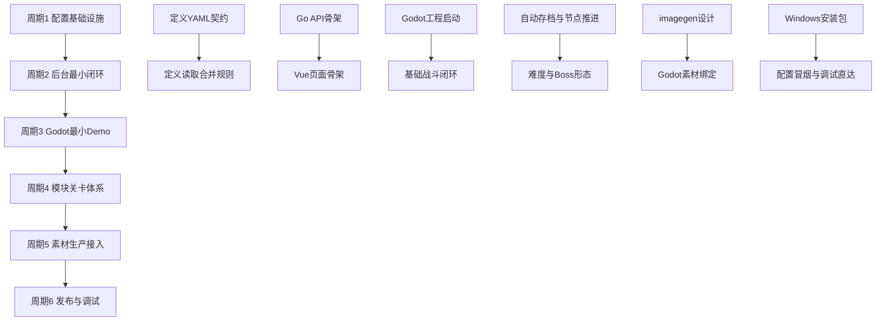

# 需求实施计划：需求点总览 v1

## 1. 基本信息

| 项目 | 内容 |
| --- | --- |
| 对应需求文档 | [2026-06-23_215445_需求点总览v1.md](2026-06-23_215445_需求点总览v1.md) |
| 对应项目设计 | [../../项目设计.md](../../项目设计.md) |
| 当前计划范围 | 将当前需求总览转成第一阶段可执行路线图，覆盖配置基础设施、后台最小闭环、Godot Demo、模块关卡、素材接入、发布调试。 |
| 当前优先闭环 | 先做可发布、可读取、可运行的最小链路：后台配置发布 YAML -> Godot 读取配置 -> 首页/模块地图 -> 选择角色和道具 -> 进入关卡战斗 -> 通关保存进度。 |
| 当前状态 | 需求总览已形成；仓库当前尚未创建 `game/` 与 `admin/`，实施需要从工程骨架开始。 |
| 计划类型 | 编码前实施计划，不直接写代码。 |

## 2. 开发周期总览

总周期说明：本计划拆成 6 个子任务周期，每个周期只承载一个清晰目标。周期之间按“配置真源 -> 后台发布 -> 游戏读取 -> 玩法闭环 -> 素材接入 -> 打包调试”顺序推进。

| 周期 | 周期目标 | 完成标志 | 与前后周期衔接 |
| --- | --- | --- | --- |
| 周期 1 | 配置基础设施 | `game/data/` 目录、YAML 样例、schema 说明、读取合并规则文档落地。 | 为后台发布和 Godot 读取提供稳定数据契约。 |
| 周期 2 | 后台最小闭环 | `admin/` Go + Vue 骨架能编辑、校验、预览并发布最小配置包。 | 产出游戏侧可读取的发布配置。 |
| 周期 3 | Godot 最小 Demo | `game/` Godot 4 工程能启动，读取配置进入首页、模块地图和一场基础战斗。 | 验证配置驱动游戏主链路成立。 |
| 周期 4 | 模块关卡体系 | 支持 20 关结构、三档难度、怪物技能开放、Boss 形态、自动存档推进。 | 将 Demo 从单场战斗扩展为模块化闯关。 |
| 周期 5 | 素材生产接入 | 通过 `imagegen` 完成首批角色、怪物、Boss、地图、技能特效设计并接入 Godot。 | 用正式素材流程替代占位资产。 |
| 周期 6 | 发布与调试 | Windows 打包、安装器、配置冒烟验证、调试直达入口、发布回滚记录可用。 | 第一阶段具备 PC 可交付能力。 |

## 3. 阶段计划

| 阶段 | 所属周期 | 阶段目标 | 只做这一件事 | 输入条件 | 输出产物 | 验证门槛 |
| --- | --- | --- | --- | --- | --- | --- |
| 阶段 1 | 周期 1 | 定义配置目录 | 建立配置目录与样例数据契约。 | 需求总览、配置目录规范。 | `game/data/` 结构方案与 YAML 样例。 | 能表达首页、全局实体、模块、关卡、技能、道具、掉落。 |
| 阶段 2 | 周期 1 | 定义运行读取规则 | 明确 Godot 读取、合并、默认值和错误处理。 | 游戏侧配置读取规范。 | 配置 schema 文档与读取约束。 | 能说明合并顺序和缺字段处理。 |
| 阶段 3 | 周期 2 | 建立后台后端骨架 | 搭 Go API、配置读写、校验、发布接口。 | 周期 1 数据契约。 | `admin/backend/` 服务骨架。 | API 能读取草稿并生成发布包。 |
| 阶段 4 | 周期 2 | 建立后台前端骨架 | 搭 Vue 页面、资源选择、表单、预览入口。 | 后端接口边界。 | `admin/frontend/` 页面骨架。 | 能配置首页展示、模块、角色、怪物、关卡。 |
| 阶段 5 | 周期 3 | 初始化 Godot 工程 | 建立 Godot 4 主工程和主场景。 | 周期 1 配置样例。 | `game/project.godot` 与主场景。 | 本地能启动到首页或模块地图。 |
| 阶段 6 | 周期 3 | 打通战斗最小闭环 | 做一场配置驱动基础战斗。 | Godot 工程可启动。 | 玩家、怪物、刷怪、金币、通关结果。 | 能进入关卡、击杀怪物、获得金币、结束关卡。 |
| 阶段 7 | 周期 4 | 建立模块连续关卡 | 实现关卡节点、连续推进和自动存档。 | 战斗最小闭环。 | 模块节点推进和存档恢复。 | 关卡结束后能进入下一关或恢复进度。 |
| 阶段 8 | 周期 4 | 建立难度和怪物形态 | 通过配置控制技能开放、Boss 和狂暴。 | 模块关卡可推进。 | 三档难度和 Boss 形态规则。 | 普通、噩梦、地狱表现不同且不靠堆血量。 |
| 阶段 9 | 周期 5 | 完成首批素材设计 | 使用 `imagegen` 生成并确认首批 2D 素材。 | 素材 brief 和模块主题。 | 角色、怪物、Boss、地图、技能特效预览。 | 素材经确认后再进入 Godot。 |
| 阶段 10 | 周期 5 | 接入素材到 Godot | 将确认素材切帧、导入、绑定配置。 | 已确认素材。 | Godot 可用 Sprite/动画/特效资源。 | 游戏能显示已绑定素材。 |
| 阶段 11 | 周期 6 | 建立打包安装链路 | 输出 Windows exe、安装器和快捷方式。 | Godot Demo 可运行。 | `tools/windows/` 打包脚本和安装器定义。 | 能生成安装包并启动游戏。 |
| 阶段 12 | 周期 6 | 建立发布调试验证 | 配置冒烟、调试直达、日志追踪。 | 后台和游戏链路可运行。 | 验证脚本、调试入口、日志说明。 | 能定位配置版本、模块、关卡、实体和错误。 |

## 4. 实施前提与引用入口

当前仓库现状：

- 已存在 `项目设计.md`、`doc/`、`.editorconfig`、`.gitattributes`、`AGENTS.md`。
- 已存在需求总览和配置设计文档。
- 原计划生成时尚未存在 `game/`、`admin/`、`tools/`、`doc/5-tests/` 目录；当前仓库已补齐目录骨架，但仍主要处于文档、规则与目录设计阶段。
- 本文当前定位：保留为“历史实施计划”，负责记录当时的周期拆分、阶段顺序、验证门槛和风险，不再承担长期目录、字段契约、配置载体和运行时边界的真相源。

当前长期规则统一引用以下正式入口：

- [总架构](../1-架构/1-总架构.md)
- [目录树](../1-架构/2-目录树.md)
- [模块职责](../1-架构/3-模块职责.md)
- [附录-配置目录规范](../1-架构/附录-配置目录规范.md)
- [附录-后台系统结构方案](../1-架构/附录-后台系统结构方案.md)
- [附录-发布包契约与三态边界](../1-架构/附录-发布包契约与三态边界.md)
- [附录-首页预览展示包与首页入口规范](../1-架构/附录-首页预览展示包与首页入口规范.md)
- [附录-模块索引与启动入口规范](../1-架构/附录-模块索引与启动入口规范.md)
- [附录-模块正文配置与模块名单规范](../1-架构/附录-模块正文配置与模块名单规范.md)
- [附录-地图分层与区域机制规范](../1-架构/附录-地图分层与区域机制规范.md)
- [附录-角色固定绑定与选择规范](../1-架构/附录-角色固定绑定与选择规范.md)
- [附录-技能配置与战斗表现规范](../1-架构/附录-技能配置与战斗表现规范.md)
- [附录-武器投射物与命中效果规范](../1-架构/附录-武器投射物与命中效果规范.md)
- [附录-状态效果与属性修饰规范](../1-架构/附录-状态效果与属性修饰规范.md)
- [附录-怪物Boss分层与难度形态规范](../1-架构/附录-怪物Boss分层与难度形态规范.md)
- [附录-道具分层与掉落奖励规范](../1-架构/附录-道具分层与掉落奖励规范.md)
- [附录-关卡节点与波次奖励规范](../1-架构/附录-关卡节点与波次奖励规范.md)
- [附录-关卡直达调试与验证入口规范](../1-架构/附录-关卡直达调试与验证入口规范.md)
- [附录-发布验证与放行闭环规范](../1-架构/附录-发布验证与放行闭环规范.md)
- [附录-Windows打包安装与分发规范](../1-架构/附录-Windows打包安装与分发规范.md)

当前正式实施导航入口见 [项目需求基线与目录归类总览实施总览](2026-06-28_项目需求基线与目录归类总览实施总览.md)；本文继续保留，主要用于回看 2026-06-23 这版周期计划如何拆解。

## 5. 计划产出范围

| 输出区域 | 本计划关注的实施产出 | 长期规则真相源 |
| --- | --- | --- |
| `game/` | Godot 4 工程、首页入口、模块地图、角色选择、战斗场景、自动存档与调试入口的周期规划。 | `doc/1-架构/1-总架构.md`、`附录-模块索引与启动入口规范.md`、`附录-关卡直达调试与验证入口规范.md` |
| `game/data/` 与发布产物 | 首页、模块、关卡、角色、怪物、Boss、技能、道具、掉落、地图的最小配置规划。 | `附录-配置目录规范.md`、`附录-发布包契约与三态边界.md`、`附录-模块正文配置与模块名单规范.md` |
| `admin/` | Go 后端 + Vue 前端的最小编辑、校验、预览、发布闭环规划。 | `附录-后台系统结构方案.md`、`附录-后台字段级配置规范.md` |
| 首页与战斗内容接入 | 首页预览、模块入口、角色、技能、固定武器、投射物、效果、怪物与 Boss 的接入规划。 | `附录-首页预览展示包与首页入口规范.md`、`附录-角色固定绑定与选择规范.md`、`附录-技能配置与战斗表现规范.md`、`附录-武器投射物与命中效果规范.md`、`附录-状态效果与属性修饰规范.md`、`附录-怪物Boss分层与难度形态规范.md` |
| 关卡与奖励推进 | 20 关结构、三档难度、节点解锁、奖励池、掉落与自动存档推进规划。 | `附录-关卡节点与波次奖励规范.md`、`附录-道具分层与掉落奖励规范.md` |
| `tools/windows/` 与验证资产 | Windows 打包、安装器、配置冒烟、调试直达与发布回滚规划。 | `附录-Windows打包安装与分发规范.md`、`附录-发布验证与放行闭环规范.md` |

## 6. 方案选择

| 方案 | 描述 | 优点 | 风险 |
| --- | --- | --- | --- |
| 方案 A：先配置契约，再后台，再 Godot | 先固定 YAML 与发布包格式，再做后台发布，最后让 Godot 消费。 | 最符合零硬编码原则，后续新增内容靠配置。 | 前期看起来慢，需要先把数据契约想清楚。 |
| 方案 B：先 Godot Demo，再反推后台 | 快速做游戏原型，后面再补后台配置。 | 见效快。 | 很容易形成硬编码，后续返工大。 |
| 方案 C：先后台全功能，再做游戏 | 先把后台做完整，再进入 Godot。 | 后台能力完整。 | 周期太长，无法早期验证游戏体验。 |

推荐方案：采用方案 A，但控制周期粒度。先做最小配置契约和最小后台发布，不追求后台全功能；随后尽快进入 Godot Demo 验证战斗与关卡闭环。

## 7. 实施步骤

1. 固定配置最小契约
   - 所属周期：周期 1
   - 所属阶段：阶段 1
   - 本步只做：定义首页、模块、关卡、角色、怪物、Boss、技能、道具、掉落、地图的最小 YAML 字段。

2. 固定游戏侧读取规则
   - 所属周期：周期 1
   - 所属阶段：阶段 2
   - 本步只做：明确发布包读取、合并优先级、默认值、错误输出和缓存策略。

3. 搭建后台 Go API 骨架
   - 所属周期：周期 2
   - 所属阶段：阶段 3
   - 本步只做：建立配置读取、保存草稿、校验、发布包生成接口。

4. 搭建后台 Vue 页面骨架
   - 所属周期：周期 2
   - 所属阶段：阶段 4
   - 本步只做：建立总览、首页配置、模块管理、资源库、预览、发布页面。

5. 初始化 Godot 工程
   - 所属周期：周期 3
   - 所属阶段：阶段 5
   - 本步只做：创建 Godot 4 工程、主场景和 autoload 入口。

6. 打通首页与模块地图
   - 所属周期：周期 3
   - 所属阶段：阶段 5
   - 本步只做：读取配置展示首页预览入口和模块地图入口。

7. 打通基础战斗
   - 所属周期：周期 3
   - 所属阶段：阶段 6
   - 本步只做：实现一场配置驱动战斗，包含玩家、怪物、刷怪、金币、通关。

8. 实现自动存档
   - 所属周期：周期 4
   - 所属阶段：阶段 7
   - 本步只做：实现每模块单一自动存档、继续上次、开始新游戏、通关写入和失败保护。

9. 实现连续关卡节点
   - 所属周期：周期 4
   - 所属阶段：阶段 7
   - 本步只做：实现 20 关配置结构、节点解锁和连续进入下一关。

10. 实现难度与怪物形态
    - 所属周期：周期 4
    - 所属阶段：阶段 8
    - 本步只做：实现普通、噩梦、地狱对技能开放、Boss 关卡、终极形态和狂暴概率的控制。

11. 生产首批正式素材
    - 所属周期：周期 5
    - 所属阶段：阶段 9
    - 本步只做：通过 `imagegen` 生成首批角色、普通怪、精英怪、Boss、地图、技能特效设计稿。

12. 接入素材并绑定配置
    - 所属周期：周期 5
    - 所属阶段：阶段 10
    - 本步只做：将确认素材导入 Godot，并通过 YAML 与后台选择器绑定。

13. 建立 Windows 打包链路
    - 所属周期：周期 6
    - 所属阶段：阶段 11
    - 本步只做：编写 Godot Windows 导出脚本和 Inno Setup 安装器定义。

14. 建立调试与验证链路
    - 所属周期：周期 6
    - 所属阶段：阶段 12
    - 本步只做：增加配置冒烟验证、开发测试直达入口、日志追踪和发布回滚记录。

## 8. 每步验证点

| 步骤 | 验证点 |
| --- | --- |
| 1 | YAML 样例能覆盖首页、模块、关卡、角色、怪物、Boss、技能、道具、掉落和地图。 |
| 2 | 文档明确 `实体覆盖 > 模块覆盖 > 全局默认 > 内置默认值`，并说明列表合并和缺字段处理。 |
| 3 | Go API 能读取配置目录，执行校验并输出发布包。 |
| 4 | Vue 页面能展示并编辑首页展示、模块、角色、怪物和关卡最小字段。 |
| 5 | Godot 工程能启动到主场景，无需后台运行也能读取已发布样例配置。 |
| 6 | 首页能展示后台配置的角色/怪物预览入口，模块地图能展示已配置模块。 |
| 7 | 玩家能进入关卡，怪物能刷新，角色能自动攻击，金币能掉落，关卡能结算。 |
| 8 | 继续上次能恢复模块进度，开始新游戏能重置当前模块自动存档。 |
| 9 | 关卡 1 结束后能自动进入下一关或解锁下一个节点，不在每关结束后强制停住。 |
| 10 | 普通难度固定随机 1 个基础技能；噩梦和地狱按配置开放 Boss 和技能。 |
| 11 | 首批素材有 imagegen 设计记录，不直接把未确认占位图当正式资产。 |
| 12 | Godot 中能显示绑定后的角色、怪物、Boss、地图和技能特效。 |
| 13 | Windows 脚本能导出 exe，安装器能创建桌面或开始菜单快捷方式。 |
| 14 | 调试入口能指定模块、关卡、角色、道具和存档状态启动；日志能追踪配置版本和实体 ID。 |

## 9. 图形化执行路径

## 10. 风险与阻断项

| 风险 | 影响 | 处理方式 |
| --- | --- | --- |
| 后台范围过大 | 周期 2 容易失控。 | 只做最小字段、校验、预览和发布，不做完整权限和复杂审计的最终版。 |
| Godot MCP 未连接 | 会阻断场景编辑和运行验证。 | 进入 Godot 实现前必须检查 Godot AI MCP 状态；纯文档阶段可跳过。 |
| 素材链路拖慢主闭环 | 周期 5 可能影响战斗验证。 | 周期 3 允许使用明确标记的占位素材，正式素材必须在周期 5 通过 imagegen 替换。 |
| 配置 schema 早期变化频繁 | 可能破坏存档兼容。 | 从第一版就保留 `schema_version`、默认值和字段别名策略。 |
| 首页预览变成完整图鉴 | 范围膨胀。 | 第一版只做轻量预览入口，完整图鉴放到 P2。 |
| 旧计划加速口径不一致 | 需求冲突。 | 新计划以第一版 1x/2x/3x 为准，10x 只作为未来扩展。 |

## 11. 数据库变更 SQL

本实施计划不涉及数据库建表或字段迁移。第一阶段后台可以先使用文件型 YAML 草稿与发布包，后续如果引入数据库，需要单独补充数据库 schema 设计和 SQL 迁移文档。

## 12. 自审结论

| 检查项 | 结论 |
| --- | --- |
| 覆盖度检查 | 已覆盖需求总览中的 P0 主链路，并保留 P1/P2 作为后续周期。 |
| 开发周期检查 | 已拆为 6 个独立周期，每个周期只有一个主目标。 |
| 阶段单一目标检查 | 12 个阶段均按单一目标描述。 |
| 计划产出范围检查 | 已按输出区域列出本计划关注的实施产出，并把长期规则改为引用 `doc/1-架构/` 正式入口。 |
| 数据库检查 | 当前不涉及数据库，已明确无需 SQL。 |
| 占位词检查 | 未保留 `TBD`、`TODO`、`后续补充`、`实现时再看`。 |
| 可执行性检查 | 每个步骤都有周期、阶段和验证点。 |
| 图文一致性检查 | Mermaid 执行路径与周期/阶段顺序一致。 |
| 用户确认状态 | 当前为新实施文档草案，可继续 review 或作为后续编码计划基线。 |

