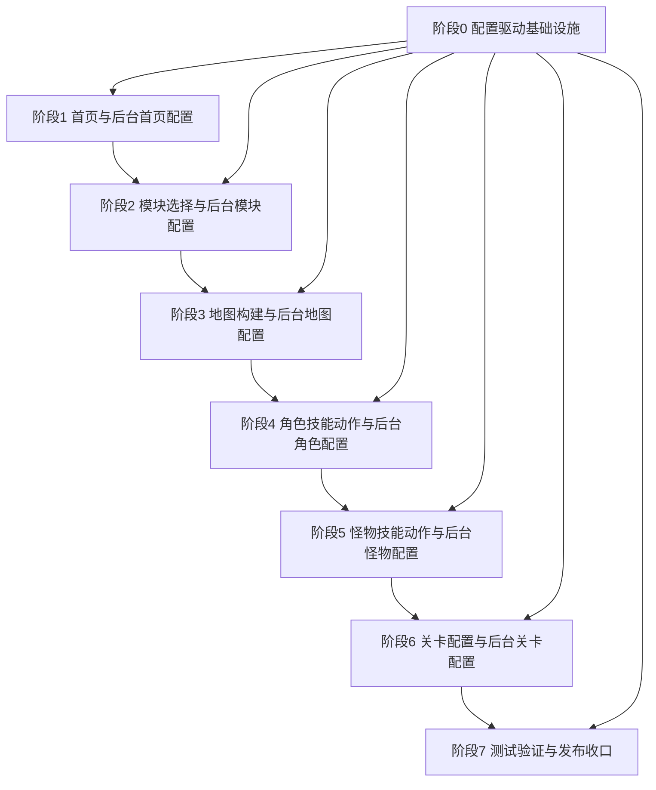

# 阶段拆分总览

## 文档信息

| 项目 | 内容 |
| --- | --- |
| 创建时间 | 2026-06-26 |
| 文档状态 | 阶段拆分草案，已补充横向基础与发布收口阶段 |
| 整理目标 | 将项目需求与设计文档拆成可独立推进的阶段文档，并统一收口到 `doc/` 体系。 |
| 拆分原则 | 每个阶段同时包含游戏侧目标与后台配置目标；后台配置是阶段交付的一部分，不作为事后补充。 |

## 阶段列表

| 阶段 | 文档 | 游戏侧目标 | 后台配置目标 |
| --- | --- | --- | --- |
| 阶段 0 | [配置驱动基础设施](2026-06-26_阶段0_配置驱动基础设施.md) | 建立发布包读取、配置合并、稳定 ID、默认值、错误处理、缓存和调试追踪。 | 建立 YAML Schema、目录管理、引用校验、发布包、版本矩阵、回滚和权限审计。 |
| 阶段 1 | [主页首页设计+后台配置主页首页管理](2026-06-26_阶段1_主页首页设计与后台配置主页首页管理.md) | 完成游戏首页、入口导航、角色怪物预览入口和基础设置入口。 | 配置首页入口、展示内容、角色怪物预览、导航、文案和可见状态。 |
| 阶段 2 | [游戏模块选择+后台配置](2026-06-26_阶段2_游戏模块选择与后台配置.md) | 完成模块选择、模块状态、继续上次、开始新游戏和模块入口。 | 配置模块列表、模块解锁、模块状态、模块入口展示和模块基础信息。 |
| 阶段 3 | [Godot AI MCP地图构建+后台配置游戏模块地图](2026-06-26_阶段3_GodotAI地图构建与后台配置游戏模块地图.md) | 通过 Godot AI MCP 构建模块地图、地图层、区域、碰撞和地图预览。 | 配置模块地图、地图素材、区域、刷怪点、事件点、机关点和地图归属。 |
| 阶段 4 | [Godot AI MCP角色+技能+动作构建+后台配置游戏模块角色](2026-06-26_阶段4_GodotAI角色技能动作构建与后台配置游戏模块角色.md) | 构建角色、固定武器、固定技能、动作帧和角色选择流程。 | 配置角色实体、技能绑定、动作资源、图标、说明、模块可用角色和外部金色道具搭配入口。 |
| 阶段 5 | [Godot AI MCP怪物+技能+动作构建+后台配置游戏模块怪物](2026-06-26_阶段5_GodotAI怪物技能动作构建与后台配置游戏模块怪物.md) | 构建普通怪、精英怪、Boss、技能动作、Boss 形态和怪物行为。 | 配置怪物实体、技能组、难度开放映射、Boss 形态、掉落表和素材绑定。 |
| 阶段 6 | [游戏关卡配置+后台配置](2026-06-26_阶段6_游戏关卡配置与后台配置.md) | 完成模块内关卡节点、连续推进、60 秒关卡、背包暂停、通关保存和关卡结算。 | 配置关卡节点、持续时间、刷怪波次、Boss 出现、奖励、难度、掉落和发布校验。 |
| 阶段 7 | [测试验证与发布收口](2026-06-26_阶段7_测试验证与发布收口.md) | 完成配置冒烟、关卡直达、存档兼容、回滚验证、Windows 打包和 PC 设置验证。 | 配置发布检查、测试任务、版本矩阵、发布记录、回滚记录、权限审计和打包参数。 |

## 阶段依赖

## 够不够用的判断

阶段 1-6 覆盖了玩家从“进入首页”到“进入模块、看地图、选角色、遇怪物、打关卡”的主链路，作为垂直内容生产链路是合理的。

但如果只保留阶段 1-6，会遗漏横向基础设施和发布收口能力。因此当前拆分补充为“阶段 0 + 阶段 1-6 + 阶段 7”：

| 阶段类型 | 为什么必须有 |
| --- | --- |
| 阶段 0 配置驱动基础设施 | 所有阶段都依赖 YAML、稳定 ID、目录规范、发布包、合并规则、校验、回滚、UTF-8、运行时读取和存档兼容。 |
| 阶段 1-6 垂直主链路 | 覆盖首页、模块、地图、角色、怪物和关卡，是第一版玩家可体验内容链路。 |
| 阶段 7 测试验证与发布收口 | 覆盖配置冒烟、调试直达、版本矩阵、回滚验证、Windows 打包、Steam/PC 基础设置和发布审计。 |

这样拆分后，既不会把所有基础设施塞进阶段 1，也不会把发布、打包、回滚、存档兼容等收口工作遗漏到最后。

## 总体验收

| 编号 | 验收标准 |
| --- | --- |
| AC-SPLIT-001 | 阶段 0-7 都有独立阶段文档。 |
| AC-SPLIT-002 | 每个阶段同时包含游戏侧目标和后台配置目标。 |
| AC-SPLIT-003 | 阶段之间存在明确依赖顺序。 |
| AC-SPLIT-004 | 阶段 0 明确承载配置基础设施，作为所有后续阶段共同依赖。 |
| AC-SPLIT-005 | 阶段 6 完成后，应能形成首页 -> 模块选择 -> 地图 -> 角色 -> 怪物 -> 关卡战斗的第一版主链路。 |
| AC-SPLIT-006 | 阶段 7 完成后，应能形成可验证、可回滚、可打包的 PC Demo 发布闭环。 |
