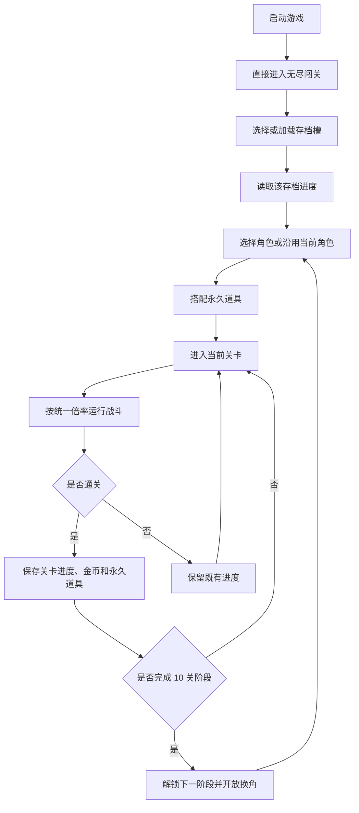
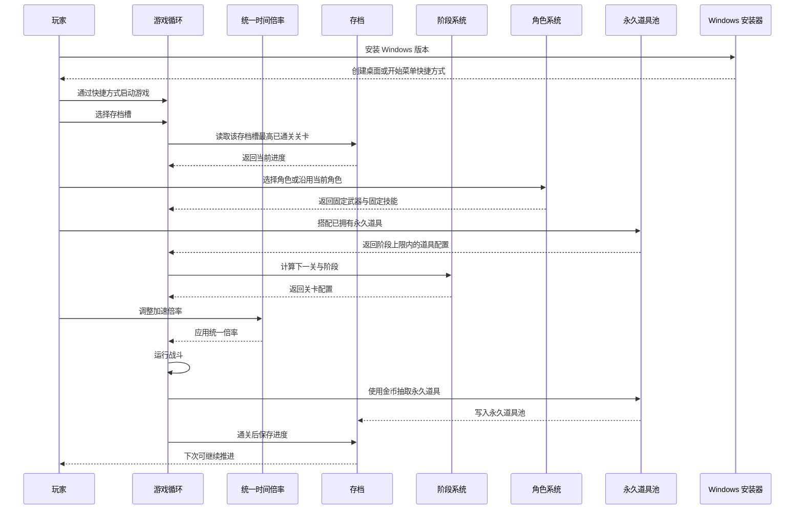

# 无尽闯关最高级原则

## 需求来源

- 提出时间：2026-06-08 23:45:00
- 来源：项目初始产品方向讨论
- 目标：先固定 Demo 和长期迭代都必须遵守的最高级产品原则，避免后续实现偏离初衷。

## 背景

项目准备制作一款面向 Steam/PC 平台、类似 Brotato 的 2D 自动战斗肉鸽闯关游戏。当前阶段不急于实现完整系统，而是先确认最顶层的产品约束：游戏应该打开即玩、以无尽闯关为默认模式，通过内容阶段扩展保持长期可玩性，并从一开始为加速、存档和 PC 桌面游戏形态留好设计边界。

## 最高级原则

| 编号 | 原则 | 说明 | 等级 |
| --- | --- | --- | --- |
| 1 | 默认无尽闯关模式 | 游戏开始即进入无尽闯关，不以复杂首页作为默认体验。 | P0 |
| 2 | 每 10 关为一个版本阶段 | 无尽模式按 10 关组织阶段，游戏版本围绕阶段推进；新的 10 关必须带来新的内容、怪物、机制、地图或同等级体验变化。 | P0 |
| 3 | 关卡难度来自怪物形态 | 不采用单纯加血、加防御的推进方式，关卡可玩性来自怪物行为、形态和组合。 | P0 |
| 4 | 默认支持最高 10 倍加速 | 游戏内必须支持可调加速，目标最高 10 倍，并统一处理公共时间数据。 | P0 |
| 5 | 支持多存档关卡进度 | 至少提供 3 个独立存档槽；每次成功闯关都保存到当前存档槽，玩家可以选择存档继续推进，也可以主动重置指定存档。 | P0 |
| 6 | 每 10 关允许重新选择角色 | 每完成 10 关进入新版本阶段时，玩家可以重新选择角色，也可以继续使用当前角色。 | P0 |
| 7 | 角色武器技能固定 | 每个角色绑定固定武器和固定技能，不做角色技能升级，也不做角色武器切换。 | P0 |
| 8 | 永久道具池驱动长期成长 | 怪物掉落金币，金币用于抽取永久道具；玩家换角或阶段切换时，可以从永久道具池中重新搭配，道具携带上限由当前 10 关版本阶段控制。 | P0 |
| 9 | 默认简体中文并预留国际化 | 游戏默认语言为简体中文；第一版只交付简体中文内容，但文案和界面实现必须预留国际化能力。 | P0 |
| 10 | 失败不惩罚长期资产 | 闯关失败不清除已通关进度、永久道具池、已解锁内容和当前存档长期资产。 | P0 |
| 11 | 配置驱动 | 关卡、阶段、怪物、角色、固定武器技能、道具、掉落、道具携带上限等长期扩展内容应优先由配置驱动。 | P0 |
| 12 | 数值可回放可调试 | 核心战斗、掉落、金币抽道具、通关结算和存档写入应保留可追踪、可回放或可调试的关键数据。 | P0 |
| 13 | 存档兼容 | 版本追加新 10 关阶段、角色、道具或配置时，旧存档应能继续使用，不得轻易报废。 | P0 |
| 14 | 开发测试环境支持关卡直达 | 开发和测试环境必须支持从指定关卡、阶段、角色、道具配置和存档状态开始测试，不要求像正式玩家流程一样从第一关开始。 | P0 |
| 15 | Godot 4 作为主游戏引擎 | 主游戏从第一阶段开始使用 Godot 4 实现 2D 渲染、动画、粒子、碰撞、输入、资源和场景管理；不使用纯 CSS 或普通网页 UI 技术作为主游戏实现方案。 | P0 |
| 16 | Steam/PC 正式游戏形态 | 本项目按 Steam 平台 PC 端正式游戏形态设计；即使第一阶段是 Demo，也必须具备桌面游戏的窗口、分辨率、输入、画面呈现、构建导出和基础完成度，不做随手脚本或临时玩具式原型。 | P0 |
| 17 | Windows 安装包交付流程 | 第一阶段起必须支持 Windows 正式打包链路：Godot 4 导出游戏 exe，安装器安装到 PC，并创建桌面或开始菜单快捷方式供玩家启动。 | P0 |

## 范围边界

| 类型 | 纳入本次原则 | 排除或延后 |
| --- | --- | --- |
| 模式 | 默认无尽闯关 | 复杂首页、多模式入口、剧情关卡暂不作为初版重点 |
| 阶段 | 10 关为一个版本阶段，新阶段必须包含新内容、怪物、机制、地图或同等级体验变化 | 不用无限线性数值膨胀或只追加关卡编号代替内容阶段 |
| 难度 | 怪物行为、形态、组合、节奏 | 不以怪物血量和防御简单递增为主要难度 |
| 加速 | 统一倍率，最高目标 10 倍 | 不接受只加速画面但破坏战斗、掉落、存档一致性 |
| 存档 | 至少 3 个独立存档槽；每个存档槽保存最高通关进度，可选择存档继续或重置指定存档 | 不在失败时清除成功进度；不把多个存档槽的进度混在一起 |
| 角色 | 每 10 关阶段切换时可重新选择角色，也可沿用当前角色 | 不强制换角；不把换角做成失败惩罚 |
| 武器技能 | 每个角色绑定固定武器和固定技能 | 不做角色技能升级树；不做角色武器切换或武器养成线 |
| 道具 | 金币抽取永久道具，永久道具池跨角色和跨阶段保留 | 不把已抽到的道具做成一次性消耗品；不让道具进度跟随角色丢失 |
| 道具搭配 | 换角或每 10 关阶段切换时可重新搭配已拥有永久道具 | 搭配数量不能无限增长，携带上限由当前版本阶段控制 |
| 语言 | 默认简体中文，第一版只交付简体中文内容，但实现需预留国际化 | 第一版不要求多语言翻译；不允许把用户可见文案写死到难以国际化的位置 |
| 失败 | 失败只影响本次挑战是否推进，不清除长期资产 | 不把失败做成删除永久道具、清空进度或回退解锁内容的惩罚 |
| 配置 | 阶段、关卡、怪物、角色、武器技能、道具、掉落和携带上限优先配置化 | 不用硬编码分支堆版本内容 |
| 调试 | 核心战斗、掉落、抽取、通关和存档结果需可追踪 | 不把关键结果变成无法复盘的黑盒 |
| 兼容 | 新版本追加内容时旧存档应继续可用 | 不因追加阶段、角色、道具或配置而让旧存档失效 |
| 测试环境 | 开发和测试环境可从指定关卡、阶段、角色、道具配置和存档状态启动 | 测试入口不混入正式玩家默认流程；正式体验仍按存档进度推进 |
| 技术实现 | 主游戏使用 Godot 4，从 Demo 第一阶段起按游戏引擎项目组织核心战斗、渲染、碰撞、动画、输入和资源 | 不使用纯 CSS、普通网页 UI 或营销页式 Web 技术实现主游戏；Web 仅可作为文档、官网、配置工具或非主循环辅助界面 |
| 交付形态 | 按 Steam/PC 桌面游戏形态设计，第一阶段也要有正式窗口、分辨率、键鼠输入、HUD 可读性、画面呈现、可导出构建、Windows 安装程序和快捷方式启动流程 | 不做命令行脚本、调试脚本、无正式窗口的临时程序、只能内部演示的玩具原型，或只能靠散落 exe/脚本启动的交付 |

## 核心流程



## 时序说明



## 设计约束

| 模块 | 约束 |
| --- | --- |
| 启动流程 | 初版启动后直接进入游戏主循环，最多保留必要的继续、重置、设置入口。 |
| 技术栈 | 主游戏使用 Godot 4；从 Demo 第一阶段起，核心战斗、渲染、动画、粒子、碰撞、输入、资源和场景管理都应落在 Godot 4 项目内。 |
| Web 辅助边界 | CSS 和普通 Web UI 只可用于文档、官网、配置工具、后台工具或非游戏主循环辅助界面，不作为主游戏实现方案。 |
| Steam/PC 形态 | 从第一阶段起按 PC 桌面游戏体验组织窗口、分辨率、键鼠输入、HUD 可读性、画面比例、音画反馈和可导出构建。 |
| Windows 安装交付 | 从第一阶段起维护 Windows 打包脚本和安装器定义；打包链路应导出 Godot Windows exe，生成安装程序，并在安装后提供桌面或开始菜单快捷方式启动。 |
| Demo 完成度 | Demo 可以使用占位美术和基础特效，但必须是可运行、可体验、可迭代的 PC 游戏版本，不是零散脚本或只验证算法的内部程序。 |
| 关卡配置 | 关卡数据必须能按版本阶段扩展，避免把所有难度写死在一条数值曲线上。 |
| 怪物系统 | 怪物需要有可扩展的行为标签或类型定义，用于表达不同形态难度。 |
| 内容阶段 | 每个新的 10 关阶段都应定义本阶段的新内容包，包括怪物、机制、地图或同等级体验变化。 |
| 时间系统 | 公共时间倍率应成为战斗、冷却、刷怪、掉落和统计共用的基础输入。 |
| 存档系统 | 至少提供 3 个独立存档槽；每个存档槽以最高已通关关卡为核心字段，后续再扩展角色、武器、成就等内容。 |
| 角色系统 | 支持玩家选择角色；每 10 关阶段切换时允许重新选择角色或沿用当前角色。 |
| 武器技能 | 每个角色的武器和技能固定，不提供角色技能升级和角色武器切换。 |
| 道具系统 | 怪物掉落金币，金币用于抽取永久道具；永久道具池跨角色、跨阶段保留。 |
| 道具搭配 | 换角或每 10 关阶段切换时可重新搭配永久道具；可携带数量上限由当前版本阶段控制。 |
| 国际化 | 默认语言为简体中文；第一版只交付简体中文，但用户可见文案应预留国际化管理方式。 |
| 失败保护 | 挑战失败不清除当前存档槽的最高通关关卡、永久道具池、已解锁角色和已解锁阶段。 |
| 配置驱动 | 阶段、关卡、怪物、角色、固定武器技能、道具、掉落和道具携带上限优先通过配置表达。 |
| 可回放调试 | 核心战斗结果、金币掉落、道具抽取、通关判定和存档写入应具备可追踪数据，便于复盘问题。 |
| 存档兼容 | 后续版本新增阶段、角色、道具或配置时，旧存档应保留可继续推进能力。 |
| 开发测试入口 | 开发和测试环境必须支持选择指定关卡、阶段、角色、道具配置和存档状态启动测试。 |
| 正式隔离 | 测试入口只用于开发和测试环境，不作为正式玩家默认流程。 |

## 第一周期开发原则

| 维度 | 规则 |
| --- | --- |
| 首版核心闭环 | 第一版只围绕选存档、选角色、搭配道具、进关战斗、掉金币、抽永久道具、通关保存、10 关阶段推进构建。 |
| 范围控制 | 图鉴、成就、复杂商店、复杂首页和多模式入口不进入第一周期，除非它们成为核心闭环必要入口。 |

## 验收标准

| 编号 | 标准 |
| --- | --- |
| AC-1 | 任何后续 Demo 设计都默认以无尽闯关为第一体验。 |
| AC-2 | 关卡规划必须能明确归属到某个 10 关版本阶段，并说明该阶段新增了哪些内容、怪物、机制、地图或同等级体验变化。 |
| AC-3 | 新关卡难度说明必须描述怪物行为或组合变化，不能只写数值增加。 |
| AC-4 | 加速设计必须明确哪些系统读取统一倍率。 |
| AC-5 | 存档设计必须至少提供 3 个独立存档槽，并支持选择存档继续推进和主动重置指定存档。 |
| AC-6 | 每完成 10 关进入新版本阶段时，必须允许玩家重新选择角色或继续使用当前角色。 |
| AC-7 | 角色配置必须体现固定武器和固定技能，不得出现角色技能升级或角色武器切换入口。 |
| AC-8 | 金币抽取到的道具必须进入永久道具池，并在后续换角或阶段切换时可重新搭配。 |
| AC-9 | 道具搭配必须有携带上限，且该上限由当前 10 关版本阶段配置控制。 |
| AC-10 | 第一版所有用户可见文案必须以简体中文呈现，同时文案组织方式必须能支持后续增加其他语言。 |
| AC-11 | 挑战失败后，最高通关关卡、永久道具池、已解锁角色和已解锁阶段不得被清除或回退。 |
| AC-12 | 阶段、关卡、怪物、角色、固定武器技能、道具、掉落和道具携带上限必须具备配置化表达方式。 |
| AC-13 | 核心战斗结果、金币掉落、道具抽取、通关判定和存档写入必须保留足够排查问题的追踪信息。 |
| AC-14 | 新版本追加阶段、角色、道具或配置后，旧存档必须仍能读取并继续推进。 |
| AC-15 | 开发和测试环境必须支持从指定关卡、阶段、角色、道具配置和存档状态启动测试。 |
| AC-16 | 测试入口不得成为正式玩家默认流程，正式玩家仍按存档进度和正常关卡推进体验游戏。 |
| AC-17 | 主游戏项目必须以 Godot 4 为引擎基础；核心战斗、渲染、输入、碰撞、动画、粒子和资源加载不得以纯 CSS 或普通网页 UI 方案实现。 |
| AC-18 | 第一阶段 Demo 必须以 Steam/PC 桌面游戏形态运行，具备正式窗口、分辨率策略、键鼠输入、HUD 可读性、基础音画反馈和可导出构建；不得只交付命令行脚本、调试脚本或临时玩具式原型。 |
| AC-19 | Windows 版本必须提供可复现打包脚本和安装器定义，能从 Godot 4 导出游戏 exe，并生成安装到 PC 的安装程序；安装后必须能通过桌面或开始菜单快捷方式启动游戏。 |

## 第一周期验收标准

| 编号 | 标准 |
| --- | --- |
| C1-AC-1 | 第一版验收范围只覆盖选存档、选角色、搭配道具、进关战斗、掉金币、抽永久道具、通关保存和 10 关阶段推进。 |
| C1-AC-2 | 图鉴、成就、复杂商店、复杂首页和多模式入口不作为第一周期验收项，除非它们成为核心闭环必要入口。 |

## 新增文件清单

```text
项目设计.md - 项目级设计主入口，记录最高级原则与长期约束。
ment/
  2026-06-08_234500_无尽闯关最高级原则.md - 本次需求基线主文档。
  2026-06-08_234500_无尽闯关最高级原则.flow.svg - 本次需求流程图。
  2026-06-08_234500_无尽闯关最高级原则.sequence.svg - 本次需求时序图。
tools/windows/
  package_windows.ps1 - Windows 打包入口脚本，串联 Godot 导出和 Inno Setup 安装器生成。
  README.md - Windows 打包、安装和快捷方式启动说明。
  installer/DaLuangDouDemo.iss - Inno Setup 安装器定义。
```

## 自审结论

- 本文已把当前讨论的核心想法升级为 P0 最高级原则。
- 本文已明确“不做复杂首页”和“不做纯数值膨胀式无尽”的排除边界。
- 本文已把加速倍率、至少 3 个独立存档槽、阶段换角、固定角色套装、永久道具池、国际化预留、失败资产保护、配置驱动、可回放调试、存档兼容、开发测试关卡直达、Godot 4 主游戏引擎、Steam/PC 正式游戏形态和 Windows 安装包交付流程列为后续系统设计必须考虑的公共约束；首版核心闭环降级为第一周期开发原则。

## 变更记录

| 时间 | 类型 | 内容 | 影响 |
| --- | --- | --- | --- |
| 2026-06-08 23:55:00 | 规则口径补充 | 将“每 10 关为一个阶段”明确为“版本阶段内容包”：新的 10 关应带来新的内容、怪物、机制、地图或同等级体验变化。 | 影响后续版本规划、关卡设计、怪物设计、地图设计和验收标准；不影响已确认的默认无尽闯关、加速和存档原则。 |
| 2026-06-09 00:05:00 | 存档规则补充 | 将“保存关卡进度”明确为“至少 3 个独立存档槽”：玩家选择存档继续推进，也可以主动重置指定存档。 | 影响后续存档结构、存档选择入口、重置逻辑和验收标准；不影响默认无尽闯关、10 关版本阶段和加速原则。 |
| 2026-06-09 00:10:09 | 角色与道具规则补充 | 增加阶段换角、固定角色武器技能、永久道具池、阶段道具携带上限规则。 | 影响后续角色系统、武器技能定义、金币掉落、道具抽取、道具搭配、阶段配置和验收标准；不影响默认无尽闯关、多存档、加速和阶段内容包原则。 |
| 2026-06-09 00:18:42 | 语言规则补充 | 增加“默认简体中文并预留国际化”最高级原则：第一版只做简体中文，但文案和界面实现必须支持后续国际化扩展。 | 影响后续 UI 文案、配置结构、资源组织和验收标准；不影响第一版只交付简体中文内容的范围。 |
| 2026-06-09 00:24:14 | 公共工程规则补充 | 增加失败不惩罚长期资产、配置驱动、数值可回放可调试、首版只做核心闭环、存档兼容五条原则。 | 影响后续数据配置、调试追踪、失败处理、版本更新、首版验收范围和存档迁移策略；不改变既有核心玩法方向。 |
| 2026-06-09 00:30:16 | 原则等级调整 | 将“首版只做核心闭环”从最高级原则降级为第一周期开发原则，并同步拆出第一周期验收标准。 | 保留第一周期范围控制，但不再作为长期 P0 约束限制后续版本扩展。 |
| 2026-06-09 00:33:02 | 测试环境规则补充 | 增加“开发测试环境支持关卡直达”最高级原则：开发和测试可从指定关卡、阶段、角色、道具配置和存档状态启动。 | 影响后续调试入口、测试工具、配置加载和验收标准；正式玩家流程仍按正常存档推进。 |
| 2026-06-09 00:44:41 | 技术栈规则补充 | 增加“Godot 4 作为主游戏引擎”最高级原则：主游戏从第一阶段开始使用 Godot 4，不使用纯 CSS 或普通网页 UI 技术实现主游戏。 | 影响后续项目初始化、渲染动画、碰撞输入、资源组织和技术选型；Web/CSS 仅保留为文档、官网、配置工具或非主循环辅助界面的可选方案。 |
| 2026-06-09 00:53:34 | 交付形态规则补充 | 增加“Steam/PC 正式游戏形态”最高级原则：项目按 Steam 平台 PC 端正式游戏形态设计，第一阶段 Demo 也不能是随手脚本或临时玩具式原型。 | 影响后续窗口分辨率、键鼠输入、HUD 可读性、音画反馈、构建导出、Demo 完成度和验收标准；不改变第一周期仍只做核心闭环的范围控制。 |
| 2026-06-09 01:30:32 | Windows 交付流程补充 | 增加“Windows 安装包交付流程”最高级原则：第一阶段起必须维护打包脚本和安装器定义，安装后通过桌面或开始菜单快捷方式启动游戏。 | 影响后续构建脚本、安装器定义、交付验收、PC 安装测试和发布流程；不改变第一周期核心玩法闭环范围。 |
