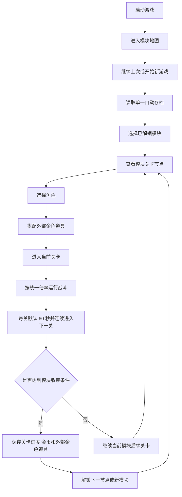
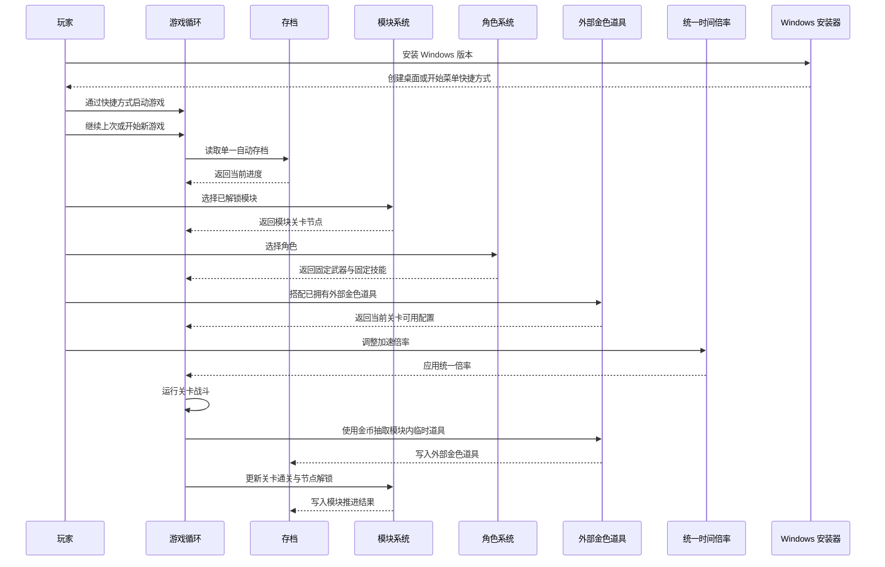

# 模块化关卡最高级原则

## 需求来源

- 提出时间：2026-06-08 23:45:00
- 最新变更时间：2026-06-21 21:09:55
- 来源：项目初始产品方向讨论，后续补充为“改成模块化关卡选择，参考植物大战僵尸的模块关卡组织方式”
- 目标：固定 Demo 和长期迭代都必须遵守的最高级产品原则，确保玩法主循环切换到模块化关卡推进后，后续实现不会偏离新方向。

## 背景

项目准备制作一款面向 Steam/PC 平台的 2D 自动战斗闯关游戏。当前方向是模块化关卡选择制：玩家从模块地图中选择不同主题模块，再进入各模块内的关卡节点推进。整体关卡组织参考《植物大战僵尸》的章节与节点节奏，不追求完全复刻塔防玩法，而是借鉴其“模块分区、逐关解锁、不同模块拥有不同地图与怪物生态”的结构化体验；具体战斗打怪与角色在地图内移动的表达参考《土豆兄弟》的自动战斗节奏。

## 关卡节奏约定

- 每个游戏模块默认 20 关，不把长线循环作为默认主循环入口。
- 每关默认持续 60 秒，关卡之间连续推进，不在单关结束后停住等待玩家确认。
- 玩家可以按键盘 `I` 键打开背包，背包状态等同于暂停游戏。
- 暂停期间怪物技能动作和角色技能动作都停止，恢复后继续按原进度执行。
- 背包打开时允许抽取新道具、查看道具、提示角色配置等交互，但不推进关卡时间。

## 素材流程

所有正式 2D 游戏素材先通过 `imagegen` skill 完成设计预览，确认帧动画、造型语言、模块视觉和关卡包装方向后，再通过 Godot AI MCP 在 Godot 工程中构建、导入和接入。这里的正式素材包括角色、怪物、Boss、地图模块、关卡节点、UI、特效、投射物、掉落物和 Sprite Sheet。

## 变更分类

| 项目 | 结论 |
| --- | --- |
| 变更类型 | 范围变化 + 交付形态变化 |
| 变更内容 | 从旧的阶段推进方案调整为“模块地图选择 + 模块内关卡节点推进” |
| 影响面 | 需求、项目设计、实施计划、验收标准、流程图、时序图 |
| 处理决策 | 继续沿用同一份需求主文档更新，不新建平行需求记录；同步重写实施计划 |

## 最高级原则

| 编号 | 原则 | 说明 | 等级 |
| --- | --- | --- | --- |
| 1 | 默认模块化关卡选择 | 游戏开始后进入模块地图或模块选择主流程。 | P0 |
| 2 | 关卡按模块组织 | 游戏内容按模块组织，每个模块拥有自己的地图主题、关卡序列、怪物生态、场景机制和视觉包装。 | P0 |
| 3 | 关卡结构参考植物大战僵尸 | 模块推进应具备“地图分区 -> 关卡节点 -> 逐关解锁 -> 模块终点或 Boss”的清晰结构；战斗表现参考《土豆兄弟》的地图内移动打怪节奏。 | P0 |
| 4 | 关卡难度来自怪物形态与地图机制 | 不采用单纯加血、加防御的推进方式，关卡可玩性来自怪物行为、形态、组合、地图机制和场地压力。 | P0 |
| 5 | 每模块三档难度 | 每个模块默认提供普通、噩梦、地狱三档难度；普通难度强调技能随机性，噩梦和地狱逐步开放完整技能与更晚出现的 BOSS 阶段，但任何难度都不靠怪物血量递增控难度。 | P0 |
| 6 | 普通难度锁定技能 | 普通难度下，同一种普通怪物、精英怪物和 BOSS 基础形态在本局开始时随机固定 1 个基础技能并锁定到通关或退出，不能中途换选。 | P0 |
| 7 | 噩梦难度开放完整技能 | 噩梦难度下，普通怪物和精英怪物开放全部技能；第 10 关 BOSS 出现基础形态，第 20 关 BOSS 出现终极形态。 | P0 |
| 8 | 地狱难度开放终极与狂暴 | 地狱难度下，普通怪物和精英怪物开放全部技能；第 5 关出现基础形态 BOSS，第 10 关出现终极形态 BOSS，第 20 关在终极形态 BOSS 被击败后按概率触发狂暴形态。 | P0 |
| 9 | 统一血量 | 同类怪物在任何难度下血量一致，不通过加血控制难度。 | P0 |
| 10 | 素材先设计再构建 | 所有正式 2D 游戏素材先通过 `imagegen` skill 设计预览，再通过 Godot AI MCP 在 Godot 工程内构建、导入和接入。 | P0 |
| 11 | 默认支持最高 10 倍加速 | 游戏内必须支持可调加速，目标最高 10 倍，并统一处理公共时间数据。 | P0 |
| 12 | 每模块默认 20 关 | 每个游戏模块默认 20 关，不把长线循环作为默认主循环入口。 | P0 |
| 13 | 单关默认 60 秒 | 每关默认持续 60 秒，并且关卡之间连续推进，不在单关结束后停住等待。 | P0 |
| 14 | I 键背包即暂停 | 玩家按 `I` 键打开背包时，游戏进入暂停；暂停期间怪物与角色的技能动作都必须停止。 | P0 |
| 15 | 单一被动存档 | 每个模块只保留一个自动存档状态；玩家不需要手动存档，也不需要选择多个存档槽，只提供“继续上次”与“开始新游戏”两个入口。 | P0 |
| 16 | 角色武器技能固定 | 每个角色绑定固定武器和固定技能，不做角色技能升级，也不做角色武器切换。 | P0 |
| 17 | 道具分层驱动成长 | 普通、紫色和临时金色属于模块内临时道具，只能在当前模块内抽取和使用；永久金色属于外部道具，只能通过通关极低概率获得，不能通过抽奖获得。 | P0 |
| 18 | 默认简体中文并预留国际化 | 游戏默认语言为简体中文；第一版只交付简体中文内容，但文案和界面实现必须预留国际化能力。 | P0 |
| 19 | 失败不惩罚长期资产 | 闯关失败不清除已通关关卡、已解锁模块、永久金色道具和当前存档长期资产；模块内临时道具只在当前模块内保留。 | P0 |
| 20 | 配置驱动 | 模块、关卡、怪物、地图机制、角色、固定武器技能、道具分层、掉落和解锁关系等长期扩展内容应优先由配置驱动。 | P0 |
| 21 | 数值可回放可调试 | 核心战斗、掉落、金币抽道具、通关结算、关卡解锁、永久金色获得和存档写入应保留可追踪、可回放或可调试的关键数据。 | P0 |
| 22 | 自动存档兼容 | 版本追加新模块、关卡、角色、道具或配置时，旧自动存档应能继续使用，不得轻易报废。 | P0 |
| 23 | 开发测试环境支持关卡直达 | 开发和测试环境必须支持从指定模块、指定关卡、指定角色、指定道具配置和指定自动存档状态开始测试。 | P0 |
| 24 | Godot 4 作为主游戏引擎 | 主游戏从第一阶段开始使用 Godot 4 实现 2D 渲染、动画、粒子、碰撞、输入、资源和场景管理；不使用纯 CSS 或普通网页 UI 技术作为主游戏实现方案。 | P0 |
| 25 | Steam/PC 正式游戏形态 | 本项目按 Steam 平台 PC 端正式游戏形态设计；即使第一阶段是 Demo，也必须具备桌面游戏的窗口、分辨率、输入、画面呈现、构建导出和基础完成度。 | P0 |
| 26 | Windows 安装包交付流程 | 第一阶段起必须支持 Windows 正式打包链路：Godot 4 导出游戏 exe，安装器安装到 PC，并创建桌面或开始菜单快捷方式供玩家启动。 | P0 |

## 范围边界

| 类型 | 纳入本次原则 | 排除或延后 |
| --- | --- | --- |
| 模式 | 模块地图选择、模块内节点关卡推进 | 只有一条线性编号关卡 |
| 模块 | 每个模块有独立主题地图、怪物生态、关卡机制 | 只换背景不换玩法、只换名字不换内容 |
| 难度 | 怪物行为、怪物组合、地形压力、模块机制 | 只靠怪物血量和防御递增 |
| 加速 | 统一倍率，最高目标 10 倍 | 只加速画面但破坏战斗、掉落、存档一致性 |
| 存档 | 每个模块只保留一个自动存档状态；记录模块解锁、关卡进度和长期资产 | 不在失败时清除成功进度；不提供多个存档槽选择 |
| 关卡节奏 | 每模块默认 20 关，每关默认 60 秒，关卡连续推进 | 不把长线循环作为默认主循环入口 |
| 暂停交互 | `I` 键打开背包等同暂停，暂停期间技能动作停止，允许抽取道具与提示角色 | 不在暂停时推进关卡时间 |
| 角色 | 每次进入关卡前可选择角色 | 不做角色技能升级树；不做角色武器切换或武器养成线 |
| 道具 | 普通、紫色、临时金色在模块内抽取和使用；永久金色只能通过极低概率通关获得 | 不把模块内临时道具做成跨模块永久资产；不把永久金色做成可抽奖获得 |
| 道具搭配 | 进入关卡前可重新搭配已拥有的外部金色道具 | 搭配数量不能无限增长，携带上限需受模块或关卡规则控制 |
| 语言 | 默认简体中文，第一版只交付简体中文内容，但实现需预留国际化 | 第一版不要求多语言翻译；不允许把用户可见文案写死到难以国际化的位置 |
| 失败 | 失败只影响本次挑战是否推进，不清除长期资产 | 不把失败做成删除永久道具、清空模块进度或回退解锁内容的惩罚 |
| 配置 | 模块、关卡、怪物、地图机制、角色、武器技能、道具、掉落和解锁关系优先配置化 | 不用硬编码分支堆版本内容 |
| 调试 | 核心战斗、掉落、抽取、通关和存档结果需可追踪 | 不把关键结果变成无法复盘的黑盒 |
| 兼容 | 新版本追加内容时旧自动存档应继续可用 | 不因追加模块、关卡、角色、道具或配置而让旧自动存档失效 |
| 测试环境 | 开发和测试环境可从指定模块、关卡、角色、道具配置和自动存档状态启动 | 测试入口不混入正式玩家默认流程；正式体验仍按自动存档推进 |
| 技术实现 | 主游戏使用 Godot 4，从 Demo 第一阶段起按游戏引擎项目组织核心战斗、渲染、碰撞、动画、输入和资源 | 不使用纯 CSS、普通网页 UI 或营销页式 Web 技术实现主游戏；Web 仅可作为文档、官网、配置工具或非主循环辅助界面 |
| 交付形态 | 按 Steam/PC 桌面游戏形态设计，第一阶段也要有正式窗口、分辨率、键鼠输入、HUD 可读性、画面呈现、可导出构建、Windows 安装程序和快捷方式启动流程 | 不做命令行脚本、调试脚本、无正式窗口的临时程序或只能内部演示的玩具原型 |
| 素材流程 | 所有正式 2D 素材先做 `imagegen` 设计预览，再进入 Godot AI MCP 构建与接入 | 不跳过设计阶段直接把占位图当最终资产 |

## 核心流程



## 时序说明



## 设计约束

| 模块 | 约束 |
| --- | --- |
| 启动流程 | 初版启动后进入模块地图主流程，最多保留必要的继续、开始新游戏、设置入口。 |
| 技术栈 | 主游戏使用 Godot 4；从 Demo 第一阶段起，核心战斗、渲染、动画、粒子、碰撞、输入、资源和场景管理都应落在 Godot 4 项目内。 |
| Web 辅助边界 | CSS 和普通 Web UI 只可用于文档、官网、配置工具、后台工具或非游戏主循环辅助界面，不作为主游戏实现方案。 |
| Steam/PC 形态 | 从第一阶段起按 PC 桌面游戏体验组织窗口、分辨率、键鼠输入、HUD 可读性、画面比例、音画反馈和可导出构建。 |
| Windows 安装交付 | 从第一阶段起维护 Windows 打包脚本和安装器定义；打包链路应导出 Godot Windows exe，生成安装程序，并在安装后提供桌面或开始菜单快捷方式启动。 |
| Demo 完成度 | Demo 可以使用占位美术和基础特效，但必须是可运行、可体验、可迭代的 PC 游戏版本，不是零散脚本或只验证算法的内部程序。 |
| 模块配置 | 模块数据必须能表达主题、地图、关卡节点、怪物池、机制规则和解锁关系。 |
| 关卡配置 | 关卡数据必须能表达模块归属、通关条件、刷怪路线、地图机关和奖励。 |
| 怪物系统 | 怪物需要有可扩展的行为标签或类型定义，用于表达不同模块中的敌人生态。 |
| 时间系统 | 公共时间倍率应成为战斗、冷却、刷怪、掉落和统计共用的基础输入。 |
| 存档系统 | 每个模块只提供一个自动存档状态；该状态以模块解锁、已通关关卡和长期资产为核心字段。 |
| 角色系统 | 支持玩家进入关卡前选择角色。 |
| 武器技能 | 每个角色的武器和技能固定，不提供角色技能升级和角色武器切换。 |
| 道具系统 | 怪物掉落金币，金币用于在当前模块内抽取普通、紫色和临时金色道具；永久金色道具只通过极低概率通关获得。 |
| 道具搭配 | 每次进入关卡前可重新搭配已拥有的外部金色道具；可携带数量上限由模块或关卡规则控制。 |
| 国际化 | 默认语言为简体中文；第一版只交付简体中文，但用户可见文案应预留国际化管理方式。 |
| 失败保护 | 挑战失败不清除当前自动存档的已通关关卡、已解锁模块、外部金色道具和已解锁角色。 |
| 配置驱动 | 模块、关卡、怪物、地图机制、角色、固定武器技能、道具、掉落和解锁关系优先通过配置表达。 |
| 可回放调试 | 核心战斗结果、金币掉落、道具抽取、通关判定、模块解锁和存档写入应具备可追踪数据。 |
| 自动存档兼容 | 后续版本新增模块、关卡、角色、道具或配置时，旧自动存档应保留可继续推进能力。 |
| 开发测试入口 | 开发和测试环境必须支持选择指定模块、关卡、角色、道具配置和自动存档状态启动测试。 |
| 正式隔离 | 测试入口只用于开发和测试环境，不作为正式玩家默认流程。 |

## 第一周期开发原则

| 维度 | 规则 |
| --- | --- |
| 首版核心闭环 | 第一版只围绕继续上次或开始新游戏、进入模块地图、选择模块关卡、选角色、搭配道具、进关战斗、掉金币、抽模块内临时道具、通关保存和节点解锁构建。 |
| 范围控制 | 图鉴、成就、复杂商店、复杂首页和多模式入口不进入第一周期，除非它们成为核心闭环必要入口。 |

## 验收标准

| 编号 | 标准 |
| --- | --- |
| AC-1 | 任何后续 Demo 设计都默认以模块地图与模块关卡选择为第一体验。 |
| AC-2 | 关卡规划必须能明确归属到某个模块，并说明该模块的地图主题、怪物生态、机制差异和视觉目标。 |
| AC-3 | 不同模块之间必须有明确差异，不允许只换贴图不换机制和怪物组合。 |
| AC-4 | 新关卡难度说明必须描述怪物行为、组合变化、地图压力或模块机制，不能只写数值增加。 |
| AC-5 | 加速设计必须明确哪些系统读取统一倍率。 |
| AC-6 | 存档设计必须支持每模块单一自动存档状态，并提供继续上次与开始新游戏入口。 |
| AC-7 | 角色配置必须体现固定武器和固定技能，不得出现角色技能升级或角色武器切换入口。 |
| AC-8 | 金币抽取到的普通、紫色和临时金色道具必须仅在当前模块内使用；永久金色道具只能通过通关极低概率获得。 |
| AC-9 | 道具搭配必须有携带上限，且该上限可由当前模块或当前关卡规则配置控制。 |
| AC-10 | 第一版所有用户可见文案必须以简体中文呈现，同时文案组织方式必须能支持后续增加其他语言。 |
| AC-11 | 挑战失败后，已通关关卡、已解锁模块、外部金色道具和已解锁角色不得被清除或回退。 |
| AC-12 | 模块、关卡、怪物、地图机制、角色、固定武器技能、道具、掉落和解锁关系必须具备配置化表达方式。 |
| AC-13 | 核心战斗结果、金币掉落、道具抽取、通关判定、模块解锁和存档写入必须保留足够排查问题的追踪信息。 |
| AC-14 | 新版本追加模块、关卡、角色、道具或配置后，旧自动存档必须仍能读取并继续推进。 |
| AC-15 | 开发和测试环境必须支持从指定模块、指定关卡、指定角色、指定道具配置和指定自动存档状态启动测试。 |
| AC-16 | 测试入口不得成为正式玩家默认流程，正式玩家仍按存档进度和正常关卡推进体验游戏。 |
| AC-17 | 主游戏项目必须以 Godot 4 为引擎基础；核心战斗、渲染、输入、碰撞、动画、粒子和资源加载不得以纯 CSS 或普通网页 UI 方案实现。 |
| AC-18 | 第一阶段 Demo 必须以 Steam/PC 桌面游戏形态运行，具备正式窗口、分辨率策略、键鼠输入、HUD 可读性、基础音画反馈和可导出构建。 |
| AC-19 | Windows 版本必须提供可复现打包脚本和安装器定义，能从 Godot 4 导出游戏 exe，并生成安装到 PC 的安装程序；安装后必须能通过桌面或开始菜单快捷方式启动游戏。 |

## 第一周期验收标准

| 编号 | 标准 |
| --- | --- |
| C1-AC-1 | 第一版验收范围只覆盖继续上次、开始新游戏、进入模块地图、选择模块关卡、选角色、搭配外部金色道具、进关战斗、掉金币、抽模块内临时道具、通关保存和节点解锁。 |
| C1-AC-2 | 图鉴、成就、复杂商店、复杂首页和多模式入口不作为第一周期验收项，除非它们成为核心闭环必要入口。 |

## 新增文件清单

```text
项目设计.md - 项目级设计主入口，记录模块化关卡最高级原则与长期约束。
ment/
  2026-06-08_234500_模块化关卡最高级原则.md - 当前需求主文档。
  2026-06-08_234500_模块化关卡最高级原则.flow.svg - 当前需求流程图。
  2026-06-08_234500_模块化关卡最高级原则.sequence.svg - 当前需求时序图。
tools/windows/
  package_windows.ps1 - Windows 打包入口脚本，串联 Godot 导出和 Inno Setup 安装器生成。
  README.md - Windows 打包、安装和快捷方式启动说明。
  installer/DaLuangDouDemo.iss - Inno Setup 安装器定义。
```

## 自审结论

- 本文已将核心方向切换为模块化关卡选择制。
- 本文已明确模块地图、模块关卡节点、模块怪物生态和模块机制差异是新的核心设计骨架。
- 本文已保留加速倍率、单一被动自动存档、固定角色套装、道具分层、国际化预留、失败资产保护、配置驱动、可回放调试、存档兼容、开发测试关卡直达、Godot 4 主游戏引擎、Steam/PC 正式游戏形态和 Windows 安装包交付流程等公共约束。
- 本文已补充正式 2D 素材先经 `imagegen` 设计预览，再由 Godot AI MCP 构建与接入的素材流程约束。

## 变更记录

| 时间 | 类型 | 内容 | 影响 |
| --- | --- | --- | --- |
| 2026-06-21 16:45:00 | 产品主循环调整 | 将旧的阶段推进方案调整为“模块地图选择 + 模块内关卡节点推进”，整体关卡结构参考《植物大战僵尸》的章节与节点组织方式。 | 影响项目设计、需求主流程、实施计划、验收标准、模块配置结构、关卡配置结构和后续实现入口。 |
| 2026-06-21 16:45:00 | 模块规则补充 | 增加“每个模块必须具备独立地图主题、怪物生态、关卡机制与视觉包装”的规则。 | 影响后续模块设计、地图设计、怪物设计、关卡机制设计和美术风格统一策略。 |
| 2026-06-21 16:45:00 | 存档口径调整 | 将存档核心字段从“最高关卡推进”扩展为“模块解锁 + 关卡通关 + 长期资产保留”。 | 影响后续存档结构、模块地图入口和模块解锁逻辑。 |
| 2026-06-21 21:09:55 | 关卡节奏补充 | 明确每个模块默认 20 关、每关默认 60 秒、关卡连续推进，以及 `I` 键背包即暂停的交互规则。 | 影响模块节奏设计、单关时长控制、暂停规则、背包交互和关卡结算结构。 |
| 2026-06-21 21:09:55 | 怪物分层调整 | 将怪物口径调整为普通怪物、精英怪物、BOSS 三层，并细分为 BOSS 基础形态、BOSS 终极形态和概率触发的 BOSS 狂暴形态。 | 影响怪物设计、技能数值、难度解锁映射、BOSS 阶段表现和后续关卡配置。 |
| 2026-06-21 21:09:55 | 模块难度调整 | 每个模块新增普通、噩梦、地狱三档难度；不同难度控制技能开放、BOSS 出现关卡和狂暴概率，且任何难度都不靠堆血量控难度。 | 影响模块难度选择、关卡节点设计、怪物技能启用、BOSS 阶段节奏和后续配置结构。 |
