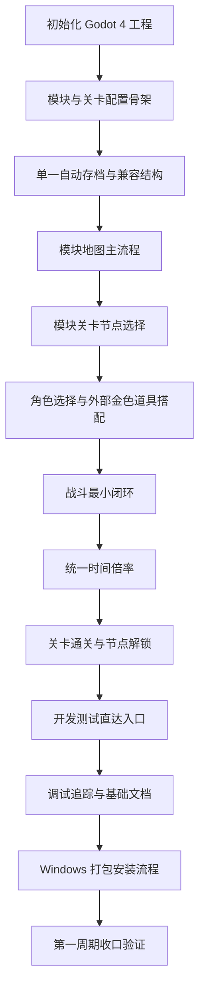

# 需求实施计划：模块化关卡最高级原则

## 1. 基本信息

- 对应需求文档：[2026-06-08_234500_模块化关卡最高级原则.md](2026-06-08_234500_模块化关卡最高级原则.md)
- 对应项目设计：[../项目设计.md](../项目设计.md)
- 当前计划范围：第一周期 Godot 4 Demo 的模块化关卡核心闭环与 Windows 安装包交付实施计划。
- 当前优先闭环：继续上次或开始新游戏、进入模块地图、选择模块关卡、选角色、搭配外部金色道具、进关战斗、每关 60 秒连续推进、掉金币、抽模块内临时道具、通关后被动保存、节点解锁。
- 当前素材工作流：所有正式 2D 素材先通过 `imagegen` skill 设计预览，再通过 Godot AI MCP 在 Godot 工程内构建与接入。
- 当前状态：需求主循环已调整为模块化关卡选择制；项目设计和需求文档已同步到新方向；本计划作为新的编码基线。
- 计划生成时间：2026-06-21 21:09:55

## 2. 需求文档分析结论

当前需求文档已经满足进入实施计划的条件：

| 检查项 | 结论 |
| --- | --- |
| 最高级原则 | 已明确 21 条 P0 原则，包括 Godot 4 主游戏引擎、Steam/PC 正式游戏形态、Windows 安装包交付流程、模块化关卡选择、单一被动自动存档、每模块 20 关、每关 60 秒、背包暂停、道具分层、配置驱动、存档兼容和开发测试直达。 |
| 最高级原则 | 已补充正式 2D 素材先经 `imagegen` 设计预览，再由 Godot AI MCP 构建与接入的素材流程。 |
| 范围边界 | 已明确第一版不做复杂首页、多模式入口、图鉴、成就、复杂商店，不使用 CSS/Web 作为主游戏方案。 |
| 第一周期闭环 | 已明确只证明模块地图 -> 模块关卡 -> 战斗通关 -> 节点解锁这一条核心闭环，并按每关 60 秒连续推进、背包暂停和道具分层规则执行。 |
| 验收标准 | 已有 AC-1 到 AC-19，以及第一周期 C1-AC-1 到 C1-AC-2。 |
| 技术方向 | 已锁定 Godot 4；Web/CSS 仅作为非主游戏辅助工具；第一阶段即按 Steam/PC 桌面游戏形态组织窗口、输入、画面、构建、安装器和快捷方式启动。 |
| 当前阻断 | 无业务阻断；后续实现需按模块配置和模块地图结构优先落骨架。 |

## 3. 现状与落点

- 当前仓库现状：根目录只有 `项目设计.md` 和 `ment/` 需求文档，尚未初始化 Godot 项目。
- 推荐项目落点：在仓库根目录新增 `game/` 作为 Godot 4 主游戏工程目录。
- 文档继续落点：需求、实施计划继续放在 `ment/`。
- 存档落点：Godot 运行时使用 `user://saves/`，仓库内只保存存档结构说明和调试样例，不提交真实玩家存档。
- 配置落点：首版配置放在 `game/data/`，优先使用 Godot 易读资源或 JSON；重点新增模块配置、模块节点配置和模块怪物池配置。
- Windows 打包落点：`tools/windows/` 放打包入口脚本、Inno Setup 安装器定义和说明文档；`build/windows/` 与 `build/installer/` 作为本地构建输出目录。

## 4. 新增文件清单

```text
game/                                                # Godot 4 主游戏工程目录
├── project.godot                                    # Godot 4 工程入口与 autoload 配置
├── scenes/
│   ├── app/
│   │   └── Main.tscn                                # 游戏主场景，承载模块地图主流程
│   ├── ui/
│   │   ├── SaveSlotSelect.tscn                      # 继续上次与开始新游戏界面
│   │   ├── ModuleMap.tscn                           # 模块地图与模块入口选择界面
│   │   ├── LevelNodeSelect.tscn                     # 模块内关卡节点选择界面
│   │   ├── RoleSelect.tscn                          # 角色选择界面
│   │   ├── ItemLoadout.tscn                         # 外部金色道具搭配界面
│   │   ├── BattleHud.tscn                           # 战斗 HUD、金币、关卡、倍率显示
│   │   └── DevLevelLauncher.tscn                    # 开发测试关卡直达入口，仅开发/测试启用
│   ├── battle/
│   │   ├── BattleStage.tscn                         # 关卡战斗场景
│   │   ├── Player.tscn                              # 玩家角色节点
│   │   ├── Enemy.tscn                               # 怪物基础节点
│   │   ├── Projectile.tscn                          # 武器或技能发射物基础节点
│   │   └── CoinDrop.tscn                            # 金币掉落节点
│   └── effects/
│       └── HitEffect.tscn                           # 命中反馈占位特效
├── scripts/
│   ├── autoload/
│   │   ├── config_db.gd                             # 加载模块、关卡、怪物、道具、文本配置
│   │   ├── save_manager.gd                          # 自动存档读写、恢复、兼容版本处理
│   │   ├── game_time.gd                             # 统一时间倍率，目标支持最高 10 倍
│   │   ├── run_state.gd                             # 当前存档、模块、关卡、角色、道具与金币状态
│   │   ├── debug_launch.gd                          # 开发测试直达参数管理
│   │   └── i18n_text.gd                             # 简体中文文案读取，预留国际化扩展
│   ├── app/
│   │   └── main.gd                                  # 主流程编排：存档、模块、节点、角色、搭配、战斗、结算
│   ├── ui/
│   │   ├── save_slot_select.gd                      # 继续上次与开始新游戏 UI 逻辑
│   │   ├── module_map.gd                            # 模块地图 UI 逻辑
│   │   ├── level_node_select.gd                     # 模块关卡节点 UI 逻辑
│   │   ├── role_select.gd                           # 角色选择 UI 逻辑
│   │   ├── item_loadout.gd                          # 道具搭配 UI 逻辑
│   │   ├── battle_hud.gd                            # 战斗 HUD 与倍率控制
│   │   └── dev_level_launcher.gd                    # 指定模块、关卡、角色、道具和存档状态启动测试
│   ├── battle/
│   │   ├── battle_stage.gd                          # 战斗主循环、通关判断、失败判断
│   │   ├── player_controller.gd                     # 玩家移动、自动攻击入口
│   │   ├── weapon_runner.gd                         # 固定武器和固定技能执行
│   │   ├── enemy_actor.gd                           # 怪物基础行为
│   │   ├── enemy_spawner.gd                         # 按模块和关卡配置刷怪
│   │   ├── projectile_actor.gd                      # 发射物运动与命中
│   │   └── coin_drop.gd                             # 金币掉落与拾取
│   └── model/
│       ├── config_types.gd                          # 配置字段结构说明与基础校验
│       └── save_schema.gd                           # 存档字段结构、版本号和兼容默认值
├── data/
│   ├── modules/module_garden.json                   # 首个模块配置：主题、解锁关系、地图包装
│   ├── levels/module_garden_nodes.json              # 首个模块的节点关卡配置
│   ├── characters.json                              # 首版角色、固定武器、固定技能配置
│   ├── enemies.json                                 # 首版怪物类型、行为标签和基础参数配置
│   ├── items.json                                   # 道具分层、携带限制和外部金色道具相关配置
│   ├── drops.json                                   # 金币掉落与道具抽取配置
│   └── i18n/zh_cn.json                              # 第一版简体中文文案
└── docs/
    ├── save_schema.md                               # 存档结构、兼容策略和字段说明
    ├── config_schema.md                             # 配置文件字段说明
    ├── module_design_baseline.md                    # 模块设计、节点结构和怪物生态基线
    ├── pc_build_baseline.md                         # PC 窗口、分辨率、输入、导出构建和 Demo 完成度基线
    └── debug_entry.md                               # 开发测试直达入口使用说明
tools/
└── windows/
    ├── package_windows.ps1                          # Windows 打包入口：Godot 导出 exe，Inno Setup 生成安装程序
    ├── README.md                                    # Windows 打包、安装和快捷方式启动说明
    └── installer/
        └── DaLuangDouDemo.iss                       # Windows 安装器定义：安装目录、桌面快捷方式、开始菜单快捷方式
build/
└── README.md                                        # 本地构建产物目录说明
test/
└── 2026-06-21_164500/
    ├── 模块化关卡主流程验证/README.md               # 本轮模块化关卡闭环验证中文说明
    └── game/scripts/autoload/validate_module_flow.py # 模块地图与节点推进静态验证脚本
```

## 5. 方案选择

| 方案 | 描述 | 优点 | 风险 |
| --- | --- | --- | --- |
| 方案 A：模块地图 + 模块节点推进 | 先建立模块地图、模块入口、模块节点和首个模块完整闭环。 | 最符合当前新需求；能尽早验证《植物大战僵尸》式章节组织是否成立。 | UI 与配置骨架会比单页关卡更复杂。 |
| 方案 B：只做关卡列表，不做模块地图 | 先用简单列表页代替模块地图，后续再升级。 | 前期更快。 | 容易把“模块化”做成假结构，后续还要大改 UI 和配置模型。 |
| 方案 C：先只写模块配置和文档，不进入 Godot 工程 | 继续细化模块规则，不进入主游戏工程。 | 文档风险低。 | 无法验证核心闭环；容易继续停留在设计阶段。 |

推荐方案：采用方案 A。第一周期不追求最终画质，但必须从 Godot 4 工程开始，先做可运行、可体验、可调试、可导出、可扩展的“模块地图 -> 节点关卡 -> 战斗 -> 解锁”最小闭环。

## 6. 第一周期实施步骤

1. 初始化 Godot 4 工程骨架  
   建立 `game/`、`project.godot`、主场景、基础目录和 autoload 单例入口，配置 PC 桌面窗口、基础分辨率和键鼠输入，确保项目能启动到主流程场景。

2. 建立模块与关卡配置骨架  
   创建模块、关卡节点、角色、怪物、道具分层、掉落和简体中文文案配置；实现 `config_db.gd` 的加载、缺字段报错和基础默认值。

3. 先完成首批素材设计预览  
   使用 `imagegen` 产出首个模块所需的角色、怪物、节点、地图和帧动画设计预览，确认后再进入 Godot AI MCP 构建与接入，避免直接把占位图当正式资产。

4. 建立单一自动存档与兼容结构  
   实现 `save_manager.gd` 和 `save_schema.gd`，支持每模块单一自动存档状态、读取、保存、模块解锁状态、存档版本号和兼容默认值。

5. 建立模块地图主流程  
   实现 `Main.tscn`、`ModuleMap.tscn` 与 `module_map.gd`，串联继续上次、开始新游戏、模块地图展示、模块入口状态和关卡节点列表入口。

6. 建立模块关卡节点选择  
   实现 `LevelNodeSelect.tscn` 与 `level_node_select.gd`，支持查看当前模块的关卡节点、通关状态、可解锁状态和进入关卡。

7. 建立角色选择与外部金色道具搭配  
   实现角色固定武器和固定技能读取；实现外部金色道具、道具携带上限和进关前重新搭配流程。

8. 建立战斗最小闭环  
   实现玩家、怪物、刷怪、自动攻击、命中、金币掉落、拾取、通关判断和失败不惩罚长期资产。

9. 建立统一时间倍率  
   实现 `game_time.gd`，让战斗移动、攻击冷却、刷怪节奏、掉落拾取和 HUD 倍率显示读取同一倍率，目标支持最高 10 倍。

10. 建立关卡通关与节点解锁  
   实现首个模块的节点推进、通关后解锁下一节点、模块完成后开放新模块入口，并把结果写入存档。

11. 建立开发测试直达入口  
   实现 `DevLevelLauncher.tscn` 和 `debug_launch.gd`，支持指定模块、关卡、角色、道具配置和金币状态启动；正式玩家默认流程不显示该入口。

12. 补齐调试追踪与基础文档  
   输出关键战斗结果、掉落、抽取、通关判定、节点解锁和存档写入日志；补齐 `save_schema.md`、`config_schema.md`、`module_design_baseline.md`、`pc_build_baseline.md` 和 `debug_entry.md`。

13. 建立 Windows 打包安装流程  
   新增 `tools/windows/package_windows.ps1`、Inno Setup 安装器定义和说明文档，支持用 Godot 4 导出 Windows exe，再生成可安装到 PC 的安装程序，并创建桌面或开始菜单快捷方式。

14. 第一周期收口验证  
   按 C1-AC-1、C1-AC-2 和 AC-1 到 AC-19 执行最小验证，确认模块化关卡核心闭环可以以 PC 桌面游戏形态跑通。

## 7. 每步验证点

| 步骤 | 验证点 |
| --- | --- |
| 1 | Godot 4 能打开 `game/project.godot`，运行后以 PC 桌面窗口进入主流程场景，不出现复杂首页。 |
| 2 | 删除或破坏任一关键配置字段时，启动阶段能给出明确错误；正常配置能加载首个模块与节点列表。 |
| 3 | 单一自动存档状态可在退出后恢复；旧版本字段缺失时能补兼容默认值。 |
| 4 | 玩家能通过继续上次进入模块地图，并正确看到已解锁和未解锁模块状态。 |
| 5 | 玩家能进入模块节点列表，查看关卡节点与通关状态，再进入当前关卡。 |
| 6 | 角色只能使用配置绑定的固定武器和固定技能；道具搭配受模块或关卡规则限制。 |
| 7 | 首批正式素材先经过 `imagegen` 设计预览，再进入 Godot AI MCP 构建与接入。 |
| 8 | 战斗中怪物能刷新、玩家能自动攻击、金币能掉落拾取；失败不回退长期资产。 |
| 9 | 1 倍、2 倍、5 倍、10 倍下，移动、冷却、刷怪和掉落逻辑使用统一倍率，不出现明显脱节。 |
| 10 | 首个模块内多个节点能按配置推进；关键节点通关后能解锁下一节点或新模块。 |
| 11 | 开发测试可从指定模块和指定状态启动；正式流程不默认展示测试入口。 |
| 12 | 通关、失败、掉落、抽取、节点解锁、模块解锁和存档写入都有可读追踪信息。 |
| 13 | Windows 打包脚本能检查 Godot 4、导出预设和 Inno Setup；安装器定义包含安装目录、桌面快捷方式、开始菜单快捷方式和安装后启动入口。 |
| 14 | 第一周期闭环完整跑通，具备正式窗口、分辨率策略、键鼠输入、HUD 可读性、基础音画反馈、可导出构建和 Windows 安装程序。 |

## 8. 图形化执行路径



## 9. 验收标准映射

| 需求验收 | 实施覆盖 |
| --- | --- |
| AC-1、C1-AC-1 | 主流程从继续上次或开始新游戏进入模块地图与模块关卡核心闭环，不做复杂首页。 |
| AC-2、AC-3、AC-4 | `module_garden.json` 与 `module_garden_nodes.json` 表达模块主题、节点结构、怪物生态和关卡机制差异，并能携带普通、噩梦、地狱三档难度与对应 BOSS 阶段节奏。 |
| AC-5 | `game_time.gd` 作为统一倍率输入。 |
| AC-6 | `save_manager.gd` 支持每模块单一自动存档状态。 |
| AC-7 | 角色固定武器和固定技能。 |
| AC-8、AC-9 | 金币抽模块内临时道具，永久金色道具只通过极低概率通关获得；外部金色道具可重新搭配，携带上限由模块或关卡规则控制。 |
| AC-10 | `zh_cn.json` 管理首版简体中文文案。 |
| AC-11 | 失败只影响本次挑战，不清除长期资产。 |
| AC-12 | 模块、关卡、怪物、地图机制、角色、武器技能、道具、掉落和解锁关系配置化。 |
| AC-13 | 关键战斗、掉落、抽取、结算、节点解锁、模块解锁和存档写入提供追踪日志。 |
| AC-14 | `save_schema.gd` 处理自动存档版本号和兼容默认值。 |
| AC-15、AC-16 | 开发测试直达入口与正式流程隔离。 |
| AC-17 | 主游戏落在 Godot 4 工程，不使用 CSS/Web 实现主游戏。 |
| AC-18 | 第一阶段 Demo 以 Steam/PC 桌面游戏形态运行，不交付命令行脚本、调试脚本或临时玩具式原型。 |
| AC-19 | `tools/windows/package_windows.ps1` 与 `DaLuangDouDemo.iss` 提供 Windows 打包、安装和快捷方式启动链路。 |
| C1-AC-2 | 不实现图鉴、成就、复杂商店、复杂首页和多模式入口。 |

## 10. 风险与阻断项

| 类型 | 内容 | 处理方式 |
| --- | --- | --- |
| Godot 环境 | 本机可能尚未安装 Godot 4 或命令行不可用。 | 实施前检查 Godot 4 可执行文件；若未安装，先补安装或记录手动打开方式。 |
| 安装器环境 | 本机可能尚未安装 Inno Setup `ISCC.exe`。 | 打包脚本提供 `-CheckOnly` 和 `-IsccExe` 参数；缺工具时输出明确提示，不伪造安装包。 |
| 模块设计失真 | 模块化很容易退化成“换皮列表关卡”。 | 在 `module_design_baseline.md` 中强制记录模块主题、怪物生态、地图机制和节点节奏差异。 |
| UI 骨架复杂度 | 模块地图与节点页比单页关卡多一层导航。 | 第一周期先做最小可用模块地图和节点列表，不追求复杂动画与大地图特效。 |
| 资源美术 | 第一周期不会达到最终商业画质。 | 使用清晰占位图形、基础粒子和命中反馈，重点验证模块结构与工程闭环。 |
| 素材流程 | 首批正式素材要先经过 `imagegen` 设计预览。 | 先锁定角色、怪物、地图和帧动画设计，再通过 Godot AI MCP 落地。 |
| 加速一致性 | 10 倍加速容易暴露冷却、刷怪和掉落节奏问题。 | 所有时间相关逻辑必须读取 `game_time.gd`，禁止局部自行计算倍率。 |
| 存档兼容 | 早期字段变化频繁。 | 从第一版存档开始保留 `schema_version` 和默认值迁移函数。 |
| 测试入口污染正式流程 | 开发测试直达可能误出现在正式体验。 | 使用调试开关或构建标记隔离，默认玩家流程不显示。 |

## 11. 数据库变更 SQL

本计划不涉及数据库、服务端表结构或 SQL 迁移。第一周期存档使用 Godot 本地 `user://` 文件存储。

## 12. 自审结论

- 覆盖度检查：已覆盖第一周期核心闭环、Godot 4 工程落点、模块地图与节点结构、Steam/PC 正式游戏形态、Windows 安装包交付流程、新增文件清单、任务顺序、验证点、风险和验收映射。
- 占位词检查：未使用 `TBD`、`TODO`、`后续补充`、`实现时再看` 作为计划占位。
- 可执行性检查：每一步都有明确目录或模块落点，并配套可检查结果。
- 图文一致性检查：流程图顺序与实施步骤一致。
- 数据库检查：本计划不涉及数据库变更，已明确无需 SQL。
- 用户确认状态：当前按最新产品方向完成计划重写，待你继续 review 或直接进入下一轮设计细化。
