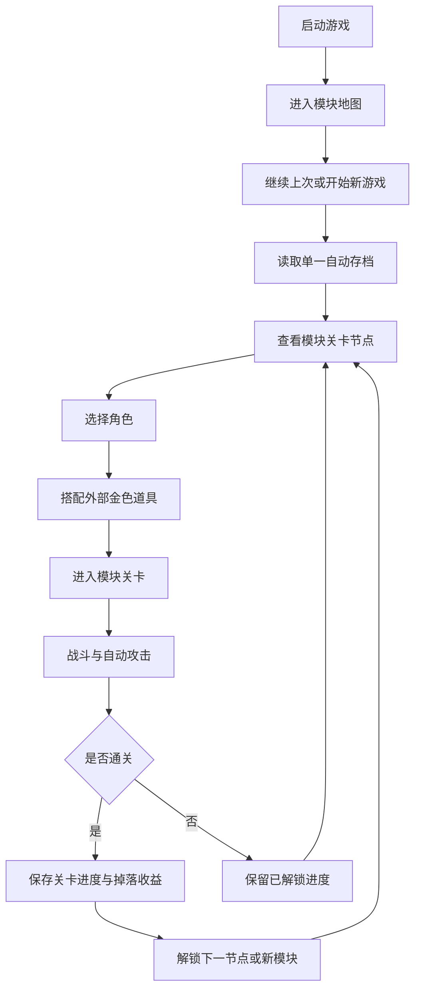

# 项目设计

## 文档说明

- 最近同步时间：2026-06-21 21:09:55
- 当前可信度：已根据最新产品方向调整为模块化关卡选择制；后续实现与需求文档应以本文为顶层约束。
- 维护原则：当玩法主循环、关卡组织、角色成长或地图模块方向发生变化时，先更新本文和对应需求文档，再进入实现。

## 产品定位

本项目是一款面向 Steam/PC 平台、参考《植物大战僵尸》关卡组织方式的 2D 自动战斗闯关游戏。第一阶段目标是先完成一个“按模块选图、按模块推进、按模块解锁内容”的可迭代 Demo，并保证后续新增模块、关卡、怪物和地图时仍能保持统一设计语言。

## 关卡节奏

- 每个游戏模块默认包含 20 关，主线以模块章节推进作为默认入口。
- 每关默认持续 60 秒，关卡之间连续推进，不在单关结束后暂停等待玩家确认。
- 玩家可通过键盘 `I` 键打开背包，背包状态等同于暂停游戏。
- 暂停期间怪物技能动作和角色技能动作都停止，恢复后继续按原进度推进。
- 背包打开后允许执行抽取新道具、查看道具、提示角色配置等交互，但不推进关卡时间。

## 道具分层

- 道具分为普通、紫色、金色三种颜色层级。
- 普通道具和紫色道具都属于模块内临时道具，只能在当前游戏模块内抽取和使用，模块结束后消失。
- 金色道具分为临时金色和永久金色两种类型。
- 临时金色道具属于模块内临时道具，只能在当前游戏模块内抽取使用，模块结束后消失。
- 永久金色道具属于外部道具，可以脱离游戏模块长期存在，模块结束后不会消失。
- 永久金色道具只能通过通关极低概率获得，不能通过抽奖获得。
- 金色永久道具的获取概率应极低，设计目标接近彩票中奖 500 万的稀有度级别。

## 素材工作流

- 所有正式 2D 游戏素材都必须先通过 `imagegen` skill 完成设计预览，再进入 Godot AI MCP 的构建与接入流程。
- 素材设计阶段优先产出帧动画、角色站姿、怪物动作、UI 组件、地图模块、关卡节点视觉和特效预览，确认后再在 Godot 工程中落地成可用资源。
- 2D 素材正式接入前，先完成风格 brief、帧动画方案、交付格式和模块归属说明，避免直接把第三方或占位图当成最终资产。

## 最高级原则

| 优先级 | 原则 | 约束 |
| --- | --- | --- |
| P0 | 默认模块化关卡选择 | 游戏启动后进入关卡地图或模块选择主流程。 |
| P0 | 关卡按模块组织 | 游戏内容按模块组织，每个模块包含自己的主题地图、关卡序列、怪物生态、场景机制和视觉包装。 |
| P0 | 关卡结构参考植物大战僵尸 | 模块推进应具备“地图分区 -> 关卡节点 -> 逐关解锁 -> 模块 Boss 或模块终点”这一类清晰结构。 |
| P0 | 难度来自怪物形态、技能和地图机制 | 关卡推进不能依赖单纯加血、加防御、加数值，必须通过怪物行为、技能可用性、怪物组合、地形压力和模块机制形成难度。 |
| P0 | 模块有清晰主题差异 | 不同模块必须在地图观感、怪物类型、关卡规则或节奏目标上形成明显区分，避免只换贴图不换玩法。 |
| P0 | 怪物按类型分层 | 怪物分为普通怪物、精英怪物和 BOSS；普通怪物只有 3 个基础技能，精英怪物具备 3 个基础技能 + 1 个终极技能，BOSS 具备基础形态、终极形态和可能的狂暴形态三段设计。 |
| P0 | 模块有三档难度 | 每个模块提供普通、噩梦、地狱三档难度；普通难度会固定随机技能并锁定到通关或退出，噩梦和地狱逐步开放更多技能与 BOSS 阶段，任何难度都不靠堆怪物血量控难度。 |
| P0 | 难度控制狂暴解锁 | 难度选择决定精英怪物、BOSS 的终极形态以及狂暴形态是否开放；狂暴形态会在一定难度以上概率出现，并不是每次终极形态被击败后都会触发，而是作为更高难度下的额外阶段。 |
| P0 | 每模块默认 20 关 | 每个游戏模块默认 20 关，主线以模块章节推进作为默认入口。 |
| P0 | 单关默认 60 秒 | 每关默认持续 60 秒，并且关卡之间连续推进，不在单关结束后停住等待。 |
| P0 | I 键背包即暂停 | 玩家按 `I` 键打开背包时，游戏进入暂停；暂停期间怪物与角色的技能动作都必须停止。 |
| P0 | 素材先设计再构建 | 所有正式 2D 游戏素材必须先通过 `imagegen` skill 设计预览，再通过 Godot AI MCP 在 Godot 工程内构建、导入和接入。 |
| P0 | 默认支持加速 | 游戏必须支持可调加速，第一版固定为 1x、2x、3x 三档循环；所有公共时间、冷却、刷怪、掉落和存档逻辑都要考虑加速一致性。 |
| P0 | 单一被动存档 | 每个模块只保留一个自动存档状态；玩家不需要手动存档，也不需要选择多个存档槽，只提供“继续上次”与“开始新游戏”两个入口。 |
| P0 | 角色套装固定 | 每个角色绑定固定武器和固定技能；不做角色技能升级，不做角色武器切换。 |
| P0 | 道具分层驱动成长 | 普通、紫色、临时金色道具属于模块内临时道具，当前模块内抽取和使用，模块结束后消失；永久金色道具属于外部道具，只能通过极低概率通关获取，不能通过抽奖获得。 |
| P0 | 默认简体中文并预留国际化 | 游戏默认语言为简体中文；第一版只交付简体中文内容，但文案和界面实现必须预留国际化能力。 |
| P0 | 失败不惩罚长期资产 | 闯关失败不清除已通关关卡、模块解锁、永久金色道具和当前自动存档长期资产；模块内临时道具在模块结束后消失。 |
| P0 | 配置驱动 | 模块、关卡、怪物、地图机制、角色、固定武器技能、道具、掉落和模块解锁关系等长期扩展内容应优先由配置驱动。 |
| P0 | 数值可回放可调试 | 核心战斗、掉落、金币抽道具、通关结算、关卡解锁和存档写入应保留可追踪、可回放或可调试的关键数据。 |
| P0 | 自动存档兼容 | 版本追加新模块、关卡、角色、道具或配置时，旧自动存档应能继续使用，不得轻易报废。 |
| P0 | 开发测试环境支持关卡直达 | 开发和测试环境必须支持从指定模块、指定关卡、指定角色、指定道具配置和指定自动存档状态开始测试。 |
| P0 | Godot 4 作为主游戏引擎 | 主游戏从第一阶段开始使用 Godot 4 实现 2D 渲染、动画、粒子、碰撞、输入、资源和场景管理；不使用纯 CSS 或普通网页 UI 技术作为主游戏实现方案。 |
| P0 | Steam/PC 正式游戏形态 | 本项目按 Steam 平台 PC 端正式游戏形态设计；即使第一阶段是 Demo，也必须具备桌面游戏的窗口、分辨率、输入、画面呈现、构建导出和基础完成度。 |
| P0 | Windows 安装包交付流程 | 第一阶段起必须支持 Windows 正式打包链路：Godot 4 导出游戏 exe，安装器安装到 PC，并创建桌面或开始菜单快捷方式供玩家启动。 |

## 明确不做

- 初版直接以模块地图与关卡节点作为默认入口。
- 不做“只有一条线性关卡编号”的假模块结构。
- 不做“怪物每关只加血加防御”的傻瓜式推进。
- 不做只换背景不换怪物生态、不换机制的伪主题模块。
- 不做把长线循环当成默认主循环入口的方案。
- 不做角色技能升级树，不做武器替换或武器养成线。
- 不把普通、紫色和临时金色道具做成跨模块永久资产；它们只在当前模块内生效。
- 不把永久金色道具做成可抽奖获得的内容，只允许通过通关极低概率获取。
- 不跳过素材设计阶段直接进 Godot 构建，正式 2D 素材必须先经 `imagegen` 设计确认。
- 不把所有怪物都写成同一套 4 技能模板；普通、精英和 BOSS 必须按类型分层。
- 第一版不交付英文或其他语言内容，但不允许把中文文案硬编码到难以国际化的位置。
- 失败不删除长期资产，只允许本次挑战未能推进当前关卡。
- 第一版不做图鉴、成就、复杂商店、复杂首页和多模式入口，除非它们成为核心闭环必要入口。
- 不使用纯 CSS、普通网页 UI 或营销页式 Web 技术来实现主游戏战斗、渲染、碰撞、动画和资源管理。
- 不把第一阶段 Demo 做成命令行脚本、调试脚本、无正式窗口的临时程序或只能内部演示的玩具原型。

## 核心循环

## 模块与关卡设计约束

| 维度 | 规则 |
| --- | --- |
| 模块组织 | 每个模块是一组有关联主题的地图与关卡集合，例如庭院、屋顶、工厂、墓园等。 |
| 模块内容 | 每个模块都应定义自己的地图视觉、怪物组合、关卡机制、节奏目标和结算奖励。 |
| 节点推进 | 模块内关卡以节点式或地图式结构逐步解锁，玩家从已解锁节点中选择下一关。 |
| 参考方向 | 关卡选择和模块节奏参考《植物大战僵尸》的章节地图感，而不是单条数值爬升。 |
| 关卡节奏 | 每个模块默认 20 关；每关默认 60 秒；关卡之间连续推进，不在单关结束后停住。 |
| 暂停交互 | 玩家按 `I` 键打开背包即暂停；暂停期间怪物技能和角色技能都停止，背包里允许抽取新道具、查看道具和提示角色。 |
| 难度来源 | 新怪物行为、怪物组合、地形限制、出怪路线、模块规则、场地压力和怪物技能解锁完整度。 |
| 数值限制 | 允许轻量数值微调，但不能作为主要难度推进手段。 |

### 怪物分级设计

| 维度 | 规则 |
| --- | --- |
| 普通怪物 | 只有 3 个基础技能。 |
| 精英怪物 | 具备 3 个基础技能 + 1 个终极技能；基础技能默认 5 秒冷却，终极技能默认 45 秒冷却。 |
| 基础形态 BOSS | 具备 3 个基础技能 + 1 个终极技能；基础技能默认 5 秒冷却，终极技能默认 45 秒冷却。 |
| 终极形态 BOSS | 在基础形态 BOSS 的 3 个基础技能 + 1 个终极技能之外，再追加 3 个基础技能 + 1 个终极技能。 |
| 狂暴形态 BOSS | 在终极形态 BOSS 被击败后，以一定难度概率触发；触发后 BOSS 立即恢复满血，并且攻速、移速和技能冷却都加快 1 倍，但血量上限不增加。 |
| 难度解锁 | 怪物形态、终极形态和狂暴形态的开放由不同难度档位控制，后续调整难度时优先改解锁映射，不直接改怪物本体结构。 |

## 模块难度设计

| 难度 | 规则 |
| --- | --- |
| 普通 | 同一种普通怪物、精英怪物和 BOSS 基础形态在本局开始时会从 3 个基础技能中随机固定 1 个技能，持续到通关或退出，不允许中途换选；BOSS 只使用基础形态且不使用终极技能。 |
| 噩梦 | 普通怪物和精英怪物可使用全部技能；第 10 关 BOSS 仅以基础形态出现并使用 3 个基础技能 + 1 个终极技能；第 20 关 BOSS 仅以终极形态出现，并可使用基础形态的 3 个基础技能 + 1 个终极技能，再加终极形态追加的 3 个基础技能 + 1 个终极技能。 |
| 地狱 | 普通怪物和精英怪物可使用全部技能；第 5 关 BOSS 仅以基础形态出现并使用 3 个基础技能 + 1 个终极技能；第 10 关 BOSS 仅以终极形态出现，并可使用全部追加技能；第 20 关 BOSS 以终极形态为基础，在被击败后按难度概率触发狂暴形态，狂暴后恢复满血并将攻速、移速和技能冷却加快 1 倍。 |
| 血量统一 | 所有难度下同类怪物的血量一致，不通过加血量来控制难度。 |

## 加速设计约束

| 对象 | 加速要求 |
| --- | --- |
| 游戏时间 | 使用统一游戏时间倍率，第一版固定为 1x、2x、3x 三档循环，避免各系统各算各的。 |
| 攻击冷却 | 冷却必须受统一倍率影响。 |
| 怪物移动与攻击 | 行为节奏必须和统一倍率一致。 |
| 刷怪与事件 | 刷新间隔、波次事件和地图机关必须和统一倍率一致。 |
| 掉落与拾取 | 掉落结果不应因倍率变化而丢失或重复。 |
| 存档统计 | 通关结果与模块解锁结果不能被倍率破坏。 |

## 存档设计约束

| 行为 | 规则 |
| --- | --- |
| 存档状态 | 每个模块仅保留一个自动存档状态，自动记录当前模块解锁状态、已通关关卡和长期资产。 |
| 通关成功 | 自动存档在每次成功通关后更新当前模块进度。 |
| 继续推进 | 玩家选择继续上次时，默认从当前自动存档对应的模块与节点继续。 |
| 挑战失败 | 不清除已通过关卡与已解锁模块。 |
| 新游戏 | 玩家选择开始新游戏时，重置当前模块的自动存档并从模块起点重新开始。 |
| 版本追加模块 | 已有进度保留，新模块自然追加到模块地图中。 |

## 角色与道具分层设计约束

| 维度 | 规则 |
| --- | --- |
| 角色选择 | 玩家每次进入关卡前选择角色；如有关卡规则限制，应在关卡前明确提示。 |
| 角色套装 | 每个角色绑定固定武器和固定技能，角色本身不通过升级获得新技能，也不切换武器。 |
| 怪物技能 | 普通怪物只有 3 个基础技能；精英怪物具备 3 个基础技能 + 1 个终极技能；基础形态 BOSS 具备 3 个基础技能 + 1 个终极技能；终极形态 BOSS 在基础形态基础上再追加 3 个基础技能 + 1 个终极技能；狂暴形态 BOSS 在终极形态基础上按难度概率触发，触发后满血并将攻速、移速和技能冷却加快 1 倍，但血量上限不增加；基础技能默认 5 秒冷却，终极技能默认 45 秒冷却。 |
| 技能解锁 | 怪物类型、终极形态和狂暴形态开放受难度档位控制，后续难度调整优先改解锁映射，不直接改怪物本体结构。 |
| 金币来源 | 怪物掉落金币，金币用于在当前模块内抽取普通、紫色和临时金色道具。 |
| 道具归属 | 普通、紫色和临时金色道具属于模块内临时道具，模块结束后消失；永久金色道具属于外部道具，脱离模块长期保留。 |
| 道具获取 | 永久金色道具只能通过通关极低概率获得，不能通过抽奖获得。 |
| 道具搭配 | 玩家每次进入关卡前可以重新搭配已拥有的外部金色道具。 |
| 携带上限 | 当前可携带道具数量有上限，上限由当前模块或当前关卡规则控制。 |

## 语言与国际化设计约束

| 维度 | 规则 |
| --- | --- |
| 默认语言 | 游戏默认语言为简体中文。 |
| 第一版范围 | 第一版只交付简体中文内容。 |
| 国际化预留 | 文案、按钮、提示、角色名、道具名、模块名、关卡名、设置项等用户可见文本应预留国际化管理方式。 |
| 范围外 | 第一版不要求翻译英文或其他语言，不要求语言切换界面完整可用。 |

## 公共工程与版本设计约束

| 维度 | 规则 |
| --- | --- |
| 主游戏引擎 | 主游戏使用 Godot 4，从 Demo 第一阶段起就按游戏引擎项目组织 2D 渲染、动画、粒子、碰撞、输入、资源和场景。 |
| Web 辅助边界 | 网页、CSS 或普通 Web UI 仅可用于文档、官网、配置工具、后台工具或非游戏主循环辅助界面，不作为主游戏实现方案。 |
| Steam/PC 形态 | 从第一阶段起按 PC 桌面游戏体验组织窗口、分辨率、键鼠输入、HUD 可读性、画面比例、音画反馈和可导出构建。 |
| Windows 交付链路 | 从第一阶段起维护 Windows 打包脚本和安装器定义，输出游戏 exe 与安装程序；安装后通过桌面快捷方式或开始菜单快捷方式启动。 |
| Demo 完成度 | Demo 可以使用占位美术和基础特效，但必须是可运行、可体验、可迭代的 PC 游戏版本，不是零散脚本或只验证算法的内部程序。 |
| 失败保护 | 挑战失败不清除当前自动存档的已通关关卡、已解锁模块、外部金色道具和已解锁角色；模块内临时道具随本模块结束清空。 |
| 配置驱动 | 模块、关卡、怪物、怪物技能、地图机制、角色、固定武器技能、道具分层、掉落和携带上限优先通过配置表达。 |
| 可回放调试 | 核心战斗结果、金币掉落、道具抽取、通关判定、关卡解锁、外部道具获得和存档写入应具备可追踪数据。 |
| 存档兼容 | 后续版本新增模块、关卡、角色、道具或配置时，旧存档应保留可继续推进能力。 |
| 开发测试入口 | 开发和测试环境必须支持选择指定模块、指定关卡、指定角色、指定道具配置和指定存档状态启动测试。 |
| 正式隔离 | 测试入口只用于开发和测试环境，不作为正式玩家默认流程。 |

## 第一周期开发原则

| 维度 | 规则 |
| --- | --- |
| 首版核心闭环 | 第一版只围绕继续上次或开始新游戏、进入模块地图、选择模块关卡、选角色、搭配外部金色道具、进关战斗、掉金币、抽模块内临时道具、通关保存和节点解锁构建。 |
| 范围控制 | 图鉴、成就、复杂商店、复杂首页和多模式入口不进入第一周期，除非它们成为核心闭环必要入口。 |

## 当前需求入口

- [2026-06-08_234500_模块化关卡最高级原则.md](ment/2026-06-08_234500_模块化关卡最高级原则.md)
