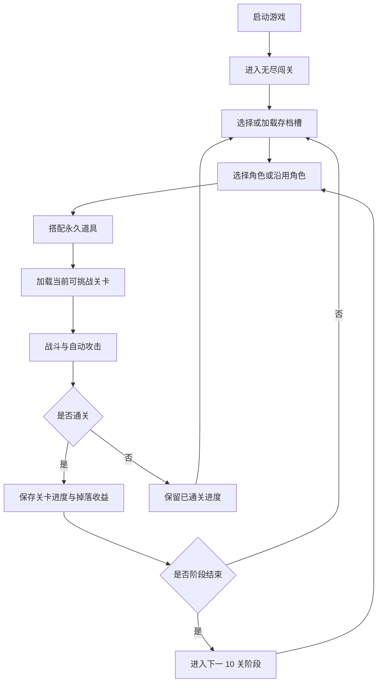

# 项目设计

## 文档说明

- 最近同步时间：2026-06-09 01:30:32
- 当前可信度：项目初始最高级产品原则，后续实现与需求文档都必须以本文为顶层约束。
- 维护原则：当玩法、关卡、数值或存档方向发生变化时，先更新本文和对应需求文档，再进入实现。

## 产品定位

本项目是一款面向 Steam/PC 平台的类 Brotato 2D 自动战斗肉鸽闯关游戏。第一阶段目标不是做复杂首页或完整商业内容，而是先完成一个可以持续迭代的无尽闯关 Demo，并保证后续新增内容不会偏离最初方向。

## 最高级原则

| 优先级 | 原则 | 约束 |
| --- | --- | --- |
| P0 | 默认无尽闯关 | 游戏启动后直接进入无尽闯关主循环，不做复杂首页作为第一屏。 |
| P0 | 10 关为一个版本阶段 | 无尽模式按每 10 关组织一个阶段；每个新版本阶段都必须带来新的内容、怪物、机制、地图或同等级体验变化。 |
| P0 | 难度来自怪物形态 | 关卡推进不能依赖单纯加血、加防御、加数值，必须通过怪物行为、组合和节奏形成难度。 |
| P0 | 默认支持加速 | 游戏必须支持可调加速，第一版固定为 1x、2x、3x 三档循环；所有公共时间、冷却、波次、掉落和存档逻辑都要考虑加速一致性。 |
| P0 | 多存档保存关卡进度 | 至少提供 3 个独立存档槽；每个存档都保存成功闯过的关卡进度，玩家可以选择存档继续推进，也可以主动重置指定存档。 |
| P0 | 每阶段允许重新选择角色 | 每完成 10 关进入新版本阶段时，玩家可以重新选择角色，也可以继续使用当前角色。 |
| P0 | 角色套装固定 | 每个角色绑定固定武器和固定技能；不做角色技能升级，不做角色武器切换。 |
| P0 | 永久道具池驱动成长 | 打怪掉落金币，金币用于抽取永久道具；玩家每次换角或阶段切换时，可以从已拥有永久道具中重新搭配，道具携带上限由当前 10 关版本阶段控制。 |
| P0 | 默认简体中文并预留国际化 | 游戏默认语言为简体中文；第一版只交付简体中文内容，但文案和界面实现必须预留国际化能力。 |
| P0 | 失败不惩罚长期资产 | 闯关失败不清除已通关进度、永久道具池、已解锁内容和当前存档长期资产。 |
| P0 | 配置驱动 | 关卡、阶段、怪物、角色、固定武器技能、道具、掉落、道具携带上限等长期扩展内容应优先由配置驱动。 |
| P0 | 数值可回放可调试 | 核心战斗、掉落、金币抽道具、通关结算和存档写入应保留可追踪、可回放或可调试的关键数据。 |
| P0 | 存档兼容 | 版本追加新 10 关阶段、角色、道具或配置时，旧存档应能继续使用，不得轻易报废。 |
| P0 | 开发测试环境支持关卡直达 | 开发和测试环境必须支持从指定关卡、阶段、角色、道具配置和存档状态开始测试，不要求像正式玩家流程一样从第一关开始。 |
| P0 | Godot 4 作为主游戏引擎 | 主游戏从第一阶段开始使用 Godot 4 实现 2D 渲染、动画、粒子、碰撞、输入、资源和场景管理；不使用纯 CSS 或普通网页 UI 技术作为主游戏实现方案。 |
| P0 | Steam/PC 正式游戏形态 | 本项目按 Steam 平台 PC 端正式游戏形态设计；即使第一阶段是 Demo，也必须具备桌面游戏的窗口、分辨率、输入、画面呈现、构建导出和基础完成度，不做随手脚本或临时玩具式原型。 |
| P0 | Windows 安装包交付流程 | 第一阶段起必须支持 Windows 正式打包链路：Godot 4 导出游戏 exe，安装器安装到 PC，并创建桌面或开始菜单快捷方式供玩家启动。 |

## 明确不做

- 初版不做营销式首页、复杂主菜单或长流程开场。
- 无尽模式不做“怪物每关只加血加防御”的傻瓜式推进。
- 加速不允许只加快画面表现而让掉落、冷却、AI 或存档统计出现不一致。
- 存档不自动回退玩家已经成功通过的关卡，除非玩家主动重置对应存档槽。
- 角色不做技能升级树，不做武器替换或武器养成线。
- 道具抽取结果不做临时局内消耗品，已抽取道具应进入玩家永久道具池。
- 阶段切换时不强制换角，玩家可以继续当前角色。
- 第一版不交付英文或其他语言内容，但不允许把中文文案硬编码到难以国际化的位置。
- 失败不删除长期资产，只允许本次挑战不推进关卡。
- 第一版不做图鉴、成就、复杂商店、复杂首页和多模式入口，除非它们是核心闭环必要入口。
- 内容扩展不依赖硬编码堆分支，新增阶段内容应优先通过配置接入。
- 开发测试入口不能混入正式玩家流程，正式体验仍按存档进度正常推进。
- 不使用纯 CSS、普通网页 UI 或营销页式 Web 技术来实现主游戏战斗、渲染、碰撞、动画和资源管理。
- 不把第一阶段 Demo 做成命令行脚本、调试脚本、无正式窗口的临时程序或只能内部演示的玩具原型。
- 不只交付散落 exe 或脚本启动方式；Windows 版本必须具备可复现的打包脚本、安装程序定义和快捷方式启动流程。

## 核心循环

## 阶段与关卡设计约束

| 维度 | 规则 |
| --- | --- |
| 阶段组织 | 每 10 关为一个阶段，例如 1-10、11-20、21-30。 |
| 更新策略 | 游戏版本围绕阶段推进；每次追加新的 10 关阶段时，应同步加入新的内容、怪物、机制、地图或同等级体验变化。 |
| 难度来源 | 新怪物行为、移动方式、攻击形态、组合方式、刷新节奏、场地压力。 |
| 数值限制 | 允许轻量数值微调，但不能作为主要难度推进手段。 |

## 加速设计约束

| 对象 | 加速要求 |
| --- | --- |
| 游戏时间 | 使用统一游戏时间倍率，第一版固定为 1x、2x、3x 三档循环，避免各系统各算各的。 |
| 攻击冷却 | 冷却必须受统一倍率影响。 |
| 怪物移动与攻击 | 行为节奏必须和统一倍率一致。 |
| 波次与刷怪 | 刷新间隔必须和统一倍率一致。 |
| 掉落与拾取 | 掉落结果不应因倍率变化而丢失或重复。 |
| 存档统计 | 通关结果以关卡成功为准，不能被倍率破坏。 |

## 存档设计约束

| 行为 | 规则 |
| --- | --- |
| 存档槽数量 | 至少提供 3 个独立存档槽，每个存档槽独立记录进度。 |
| 通关成功 | 记录当前存档槽的最高已通过关卡。 |
| 继续推进 | 玩家选择存档槽后，默认从该存档槽的下一个未通过关卡继续。 |
| 挑战失败 | 不清除已通过进度。 |
| 重置进度 | 只能由玩家主动触发，并且只重置被选中的存档槽。 |
| 版本追加阶段 | 已有进度保留，新阶段自然接在当前最高关卡之后。 |

## 角色与永久道具设计约束

| 维度 | 规则 |
| --- | --- |
| 角色选择 | 玩家选择角色进入闯关；每完成 10 关进入新版本阶段时，可以重新选择角色，也可以沿用当前角色。 |
| 角色套装 | 每个角色绑定固定武器和固定技能，角色本身不通过升级获得新技能，也不切换武器。 |
| 金币来源 | 怪物掉落金币，金币用于抽取道具。 |
| 道具归属 | 抽取到的道具进入永久道具池，后续换角和阶段切换时仍可使用。 |
| 道具搭配 | 玩家每次切换角色或每 10 关阶段切换时，可以重新搭配已拥有的永久道具。 |
| 携带上限 | 当前可携带道具数量有上限，上限由当前 10 关版本阶段控制。 |

## 语言与国际化设计约束

| 维度 | 规则 |
| --- | --- |
| 默认语言 | 游戏默认语言为简体中文。 |
| 第一版范围 | 第一版只交付简体中文内容。 |
| 国际化预留 | 文案、按钮、提示、角色名、道具名、关卡名、设置项等用户可见文本应预留国际化管理方式。 |
| 范围外 | 第一版不要求翻译英文或其他语言，不要求语言切换界面完整可用。 |

## 公共工程与版本设计约束

| 维度 | 规则 |
| --- | --- |
| 主游戏引擎 | 主游戏使用 Godot 4，从 Demo 第一阶段起就按游戏引擎项目组织 2D 渲染、动画、粒子、碰撞、输入、资源和场景。 |
| Web 辅助边界 | 网页、CSS 或普通 Web UI 仅可用于文档、官网、配置工具、后台工具或非游戏主循环辅助界面，不作为主游戏实现方案。 |
| Steam/PC 形态 | 从第一阶段起按 PC 桌面游戏体验组织窗口、分辨率、键鼠输入、HUD 可读性、画面比例、音画反馈和可导出构建。 |
| Windows 交付链路 | 从第一阶段起维护 Windows 打包脚本和安装器定义，输出游戏 exe 与安装程序；安装后通过桌面快捷方式或开始菜单快捷方式启动。 |
| Demo 完成度 | Demo 可以使用占位美术和基础特效，但必须是可运行、可体验、可迭代的 PC 游戏版本，不是零散脚本或只验证算法的内部程序。 |
| 失败保护 | 挑战失败不清除当前存档槽的最高通关关卡、永久道具池、已解锁角色和已解锁阶段。 |
| 配置驱动 | 阶段、关卡、怪物、角色、固定武器技能、道具、掉落和道具携带上限优先通过配置表达。 |
| 可回放调试 | 核心战斗结果、金币掉落、道具抽取、通关判定和存档写入应具备可追踪数据，便于复盘问题。 |
| 存档兼容 | 后续版本新增阶段、角色、道具或配置时，旧存档应保留可继续推进能力。 |
| 开发测试入口 | 开发和测试环境必须支持选择指定关卡、阶段、角色、道具配置和存档状态启动测试。 |
| 正式隔离 | 测试入口只用于开发和测试环境，不作为正式玩家默认流程。 |

## 第一周期开发原则

| 维度 | 规则 |
| --- | --- |
| 首版核心闭环 | 第一版只围绕选存档、选角色、搭配道具、进关战斗、掉金币、抽永久道具、通关保存、10 关阶段推进构建。 |
| 范围控制 | 图鉴、成就、复杂商店、复杂首页和多模式入口不进入第一周期，除非它们成为核心闭环必要入口。 |

## 当前需求入口

- [2026-06-08_234500_无尽闯关最高级原则.md](ment/2026-06-08_234500_无尽闯关最高级原则.md)
